[**HOME**](/README.md)

# 영상 인식 - 일지

- [영상 인식 - 일지](#영상-인식---일지)
  - [당구대 인식](#당구대-인식)
  - [당구공 인식](#당구공-인식)
  - [큐대 인식](#큐대-인식)
- [일지](#일지)
  - [200804-1130](#200804-1130)
  - [200804-1530](#200804-1530)
  - [200804-1630](#200804-1630)
  - [200804-1900](#200804-1900)
  - [200804-2200](#200804-2200)
  - [200804-2230](#200804-2230)
  - [200804-2300](#200804-2300)
  - [200805-1100](#200805-1100)
  - [200805-1130](#200805-1130)
  - [200805-1200](#200805-1200)
  - [200805-1530](#200805-1530)
  - [200805-1630](#200805-1630)
  - [200805-1700](#200805-1700)
  - [200807-0830](#200807-0830)
  - [200807-1000](#200807-1000)
  - [200807-1730](#200807-1730)
  - [200807-2030](#200807-2030)
  - [200807-2130](#200807-2130)
  - [200809-1700](#200809-1700)
  - [200809-1800](#200809-1800)
  - [200810-1630](#200810-1630)
  - [200810-2200](#200810-2200)
  - [200811-1422](#200811-1422)
  - [200811-1946](#200811-1946)
  - [200811-2323](#200811-2323)
  - [200812-1139](#200812-1139)
  - [200812-1654](#200812-1654)
  - [200812-1833](#200812-1833)
  - [200812-2000](#200812-2000)
  - [200812-2318](#200812-2318)
  - [200813-1637](#200813-1637)
  - [200813-1850](#200813-1850)
  - [200813-2005](#200813-2005)
  - [200813-2041](#200813-2041)
  - [200813-2111](#200813-2111)
  - [200813-2137](#200813-2137)
  - [200814-0833](#200814-0833)
  - [200817-1148](#200817-1148)
  - [200817-1416](#200817-1416)
  - [200823-1546](#200823-1546)
  - [200823-2116](#200823-2116)
  - [200824-1300](#200824-1300)
  - [200825-0958](#200825-0958)
  - [200825-1826](#200825-1826)
  - [200826-1247](#200826-1247)
  - [200826-1339](#200826-1339)
  - [200827-1340](#200827-1340)
  - [200827-1703](#200827-1703)
  - [200828-1311](#200828-1311)
  - [200830-0938](#200830-0938)
  - [200830-1122](#200830-1122)
  - [200831-1325](#200831-1325)
  - [200901-1427](#200901-1427)
  - [200906-1311](#200906-1311)
  - [200907-1309](#200907-1309)
  - [200909-1426](#200909-1426)
  - [200911-1112](#200911-1112)
  - [200916-2100](#200916-2100)

## 당구대 인식

당구대의 쿠션 외각 4개 점을 HSL 색공간에서의 간단한 필터링을 통해 획득하고, 이들로부터 원점에 위치한 당구대에 대한 Perspective Transform을 계산합니다. 계산된 트랜스폼은 카메라 원점으로부터 당구대 평면 노멀의 상대 트랜스폼이 됩니다. 특히, 오큘러스 리프트는 정교한 헤드 트래킹 방법을 제공하기 때문에, 1차적으로 당구대의 위치를 계산한 이후에는 간헐적으로 오차 보정만 수행하고, 오큘러스 리프트의 트래킹에 당구대의 위치를 의존합니다.

간단한 2D 기반 영상 인식 방법이지만, 퍼포먼스가 우수하고 구현이 간단하므로 최우선적으로 도입합니다.

## 당구공 인식


당구공은 단순한 구체이기 때문에 스크린 상에서 간단하게 검출할 수 있지만, 실제로 당구공이 표면에 접한 위치를 찾아내는 것은 꽤 까다로운 일입니다. 깊이 맵 상에서, 당구공 표면의 중점에 대한 정확한 상대 좌표를 알 수 있다면 당구공의 반지름만큼을 카메라 바깥 방향으로 투사해 당구공 구체의 중점을 구하고, 이를 다시 당구대의 법선 역방향으로 투사해 평면에 대한 구의 접점을 구할 수 있습니다.


다만, ZED M 깊이 카메라로부터 획득한 포인트 클라우드의 노이즈가 예상보다 심하다는 게 문제인데, 이 부분은 차차 해결해 나가야 할 것으로 보입니다.

## 큐대 인식

사실상 가장 까다로운 부분인데, 일단 당구공의 포즈는 정적이기 때문에 point cloud상에서 registration을 통해 transform을 추출해내는 방법을 고려하고 있습니다. 

# 일지

## 200804-1130

OpenCV와 ZED SDK, CUDA Toolkit등을 설치 완료하고, 빌드 환경을 구성했습니다.

## 200804-1530


카메라 연결 성공, ZED SDK 내부 데이터 형식인 sl::Mat을 cv::Mat으로 컨버팅하고 cv::imshow 함수를 통해 디스플레이

## 200804-1630

당구대, 당구공 등의 물체는 강한 원색을 띠므로, HSL 색공간으로 전환하고 Hue만을 도출하여 각 물체의 윤곽선을 검출하고자 합니다.


HSL 색공간으로 데이터를 표현하자 당구대의 네 귀퉁이가 선명하게 드러납니다. 그러나 벽면을 보면, Lightness가 높은 흰색 물체라 Hue값의 의미가 없음에도 불구하고 Hue가 보라색으로 잡히고, 검은색 받침대는 파란색이 잡힙니다.


이는 Saturation값만을 표현한 이미지로, 벽면의 Saturation이 정상적으로 연하게 잡히는 것을 확인할 수 있습니다. Hue 값이 0으로 고정되어 있기 때문에 이미지는 전반적으로 파란 톤을 띱니다.

널브러진 흰 티나 당구대의 음영 부분의 Saturation도 100%가 잡히는 문제가 있는데, 이는 Lightness가 0% 또는 100%일 때 Saturation이 100%로 고정되면서 발생하는 문제로, 향후 Lightness가 극단적인 수치를 갖는 픽셀의 Saturation을 0으로 설정하는 처리를 수행할 예정입니다.


이는 Saturation과 Hue를 결합한 이미지로, 한 눈에 보기에도 다른 곳에 비해 당구대의 색감이 강하게 드러납니다. 이 상태에서 Hue를 당구대 색상으로 필터링하면 당구대의 영역을 구할 수 있을 것으로 보입니다.

## 200804-1900

HSL 색공간은 Hue의 cyclic한 특성으로 인해 OpenCV의 내장 필터링 함수(Threshold)로 필터링을 수행하기가 다소 난해합니다. 만약 HSI 채널의 Saturation과 Hue 값을 사용한다면, 이는 사실 YUV, Lab처럼 밝기를 별도의 채널로 빼낸 색공간에서 밝기 채널을 고정시키는 것과 같은 효과이므로, 이들 방법 또한 시도해봅니다.


YUV 색공간에서 Y값을 고정한 이미지로, 각 엘리먼트의 색상을 꽤 명료하게 잡아내지만 당구대의 바깥틀에 가려진 음영 부위의 식별이 다소 모호합니다. 

> 
> <br> FIX: OpenCV에서 따르는 HSL 모델은 위와 같으며, 따라서 Hue는 딱히 cyclic하지 않습니다. 
> <br> YUV의 퍼포먼스가 그다지 뛰어나지 못하다는 것도 확인했으므로, 원래대로 HSL 색공간을 활용합니다.

## 200804-2200


HSL 색공간에서 HSL 값 각각에 대해, $H=[0, 35], S=[180,250], V=[20, 230]$의 값으로 필터링을 수행한 결과입니다.


그러나 카메라의 자동 노출에 꽤 취약합니다.

## 200804-2230


앞서 언급된 자동 노출 문제는, 사실은 [200804-1900](##200804-1900)에서 언급된 Hue의 Cyclic한 특성으로 인한 것으로 판단됩니다. 필터를 낮 은레벨, 높은 레벨 두 번에 걸쳐 걸자 정상적으로 당구대 영역이 검출되었습니다.


앞서 검출된 영역을 원본 이미지와 합성한 결과로, 단순히 마스크를 시각화합니다. 위에서 하늘색 이불이 잘못 필터링되는 문제가 있는데, 이는 차후 다른 색공간에서의 필터링 작업을 통해 교정할 예정입니다.

이 과정까지의 소모 시간은 약 5ms 안팎으로, 1초에 30프레임을 목표로 삼았을 때(33ms per frame) 제법 여유가 있는 수준입니다.


필터 값의 조정을 통해서도 영역의 검출이 가능하지만, 당구대 자체의 영역이 침식되는 문제가 있습니다.  


YUV 색상 기반의 필터입니다. 훨씬 깔끔하게 동작하고, 동작 속도도 20% 개선됩니다. (1ms 단축)


이렇게 생성된 마스크에 침식(cv::erode)과 팽창(cv::dilate) 연산을 반복적으로(iterations:25) 적용한 결과입니다. 당구대 영역이 거의 완벽하게 검출됩니다. 

이 과정에서 추가되는 연산량은 약 1.5ms정도로, 결과물의 품질을 고려하면 꽤 합리적입니다.


단, 팽창-침식 연산 자체의 문제점으로 당구대의 바운드가 경계면에 다가갈 경우 위 이미지와 같이 마스크가 비정상적으로 팽창됩니다. 

하지만 당구대의 트랜스폼 검출 정보는 최초 1회만 수행되고, 이후에는 오류 검출을 위해 confidence가 아주 높을 때에만 위치 보정을 위해 부차적으로 활용되며, 따라서 이미지에서 당구대의 ROI rectangle만 추려낼 수 있다면 반복적인 침식-팽창 연산으로 인한 glitch는 무시할 수 있는 수준입니다.

> 당구대 ROI는 연산 최적화를 위해 고려합니다. 체감상 영상 처리 알고리즘의 퍼포먼스에는 해상도가 미치는 영향이 가장 지배적이었습니다.

## 200804-2300

> NOTE: 현재 Stereo camera의 이미지 중 좌안의 이미지만 활용하고 있는데, 향후 좌안 카메라의 이미지로부터 당구대의 정확한 트랜스폼을 구할 수 있다면, 단순히 좌안 카메라를 상대 좌표계의 원점으로 삼고, 우안 카메라의 원점을 오프셋 시킴으로써 좌안 카메라로부터 검출된 트랜스폼 정보를 우안 카메라에 동기시킬 수 있을 것으로 보입니다. 
>
> 아직까지는 확정된 것이 없기 때문에, 일단 아이디어로써 적어둡니다.

## 200805-1100


컬러 이미지에 검출된 당구대 영역을 ZED의 스테레오 카메라로부터 도출된 깊이 맵 정보로 오버레이한 모습입니다. 


당구대 도형의 네 contour의 정확한 위치 좌표를 알 수 있다면 가장 이상적인 방법으로 정확한 당구대의 위치를 추론할 수 있겠으나, 위 그림과 같이 깊이 맵을 오버레이한 경우 깊이 맵과 컬러 이미지 사이에 꽤 큰 오프셋이 보입니다.

당구공은 거의 통째로 옆으로 옮겨 놓은 수준이라, 실제 활용이 다소 어려워 보입니다.

## 200805-1130


설정 상에 다소 오류가 있었는데, 깊이 이미지와 컬러 이미지 모두 좌안 기준으로 생성되게 함으로써 매칭 이슈가 해결되었습니다. 

여기까지 걸린 전체 프로세스는 약 60 ms 내외로, 깊이 이미지와 컬러 이미지 두 개를 retrieve하면서 퍼포먼스가 굉장히 떨어지게 되었는데, GPU 사용률은 30% 안쪽이고, CPU는 코어 하나만 죽도록 갈구는 상황으로 보입니다.


특히 zed 카메라로부터 이미지를 획득하는 코드의 부하가 높았습니다. 추후 이 구간이 퍼포먼스에 큰 병목이 될 경우, 한 프레임정도의 딜레이를 감수하고 별도의 스레드로 캡처 코드를 빼내는 편이 나을 듯합니다.


나머지 병목은 대부분 UMat을 활용하지 못하는 함수나 UMat-Mat 사이에 데이터를 전송하는 부분에서 발생했습니다. 이 부분의 최적화는 알고리즘을 어느 정도 다듬은 후, 천천히 고민해볼 문제로 보입니다.

> 현재 CPU 코어가 하나만 돌아가고 있는데, WITH_TBB, WITH_OpenMP 등의 플래그를 활성화한 opencv 빌드를 사용해 퍼포먼스를 개선할 수 있을 것으로 보입니다.

## 200805-1200


이미 필터링을 통해 당구대 영역을 바이너리 마스크의 형태로 구한 상태이므로, 단순히 1회 침식한 이미지를 마스크에서 빼줌으로써 간단하게 경계선을 구할 수 있습니다. 


컨벡스 헐 연산을 통해 당구대 영역을 비교적 정확하게 검출할 수 있습니다. 


Contour 개수가 지나치게 많이 잡히는 문제는 apporxPolyDP 함수에 큰 epsilon값을 인자로 주어 해결할 수 있었습니다. 


위 이미지를 보면 여러 거짓 셰이프가 잡히는 것을 볼 수 있는데, 이를 셰이프의 면적과 contour 개수로 필터링합니다.

## 200805-1530

당구대의 perspective를 게산합니다. 여기서는 카메라의 intrinsic parameter등을 고려하지 않고, 간단한 선형 프로토타이핑을 수행합니다. 

> 사실 포인트 클라우드로부터 계산하는 것이 더 간단하게 구현할 수 있지만, 깊이 이미지는 정확도가 십 센치미터 단위로 널뛰기를 해서 일단 2D 방법을 먼저 고려합니다.

ZED는 카메라 오른쪽이 X, 아래쪽이 Y이고 전방이 Z인 오른손 좌표계를 따릅니다. 


위 그림과 같은 방법으로 96x51\[cm\] 크기의 당구대가 1 미터 거리에서 차지하는 시야각을 구하고, 이 값으로 1미터 거리의에서 이미지 중앙에 놓인 당구대가 사진 상에서 차지하는 네 점의 좌표를 구합니다. 이 값이 pivot이 됩니다.

이를 통해 검출된 당구대의 네 contour로 실제 당구대의 perspective를 구할 수 있다면, 해당 perspective matrix를 (0, 0, 1) 좌표에 곱하면 카메라에 대한 당구대의 상대 좌표를 구할 수 있을 것으로 기대합니다.

## 200805-1630


1m 거리에서 당구대를 보았을 때의 네 귀퉁이를 노란색 점으로 오버레이합니다. 


얼추 맞는 것으로 보입니다.


## 200805-1700

Perspective Transform의 용도에 대해 잘못 생각한 것 같습니다.

해당 함수의 의의는 2D 좌표 사이를 매핑하는 것으로, X, Y, Z 트랜스폼과 3개 축에 대한 회전 값을 담는 행렬을 반환하는 마술 같은 함수는 아니었습니다.

어쩌다 그런 생각을 하게 됐는지 모르겠네요 ...

<br><br><br>

현재 기준점과 목표 지점 두 가지를 모두 아는 상황이므로, "기준 정점에 변환 행렬을 적용 -> 다시 투영 -> 검출 정점과 변환된 기준 정점 사이의 오차를 비교"하는 프로세스를 반복적으로 적용하며 오차를 좁혀 나가는 방법을 고려해볼 수 있을 듯합니다.

수학적인 기반이 있다면 좀 더 세련된 매칭 방법을 생각해낼 수 있겠지만, 당장은 이 정도가 한계라고 생각됩니다.

일단은 당초 PLAN B로 생각해두었던, ZED 카메라에서 획득한 깊이 데이터를 활용하여 당구대의 위치를 획득하고, 시야가 바뀜에 따라 점진적으로 당구대의 위치를 교정해 나가는 방법을 적용할 계획입니다.

## 200807-0830

ZED SDK는 각각의 픽셀 좌표 u, v에서의 깊이 값으로부터 카메라에 대한 상대 좌표 x, y, z를 얻는 방법을 제공합니다. 위에서 당구대의 네 귀퉁이에 대한 u, v를 이미 계산했으니 이들의 카메라에 대한 상대 좌표를 얻는 것은 간단합니다.


> 간헐적으로 귀퉁이의 점이 NaN을 반환하는 경우가 있는데, 색상이 변하는 지점에서 confidence가 낮게 나타나 픽셀이 반환되지 않은 것으로 보입니다. 향후 인근의 픽셀들의 좌표를 병합해 NaN의 발생 빈도를 줄이는 방향으로 개선할 생각입니다.

이제 카메라의 transform을 활용해 이들의 좌표를 월드 좌표로 매핑해주어야 하는데, 보통 3D 공간의 affine matrix는 $M_{orientation} \times M_{translation}$ (단, 각각 카메라의 회전과 위치)으로 구성되므로, 각 점에는 $M_{translation}^{-1}\times M_{orientation}^{-1}$ 변환 행렬을 곱해주어야 할 것입니다.

상대 좌표에 위치한 포인트를 월드 좌표로 변환하는 동작은 꽤 흔하게 사용되므로, 아마 SDK에서 해당 함수성을 제공할 것으로 생각됩니다.


## 200807-1000


> ZED 카메라가 pose를 잃어버렸거나 당구대가 제대로 인식되지 않았을 때 Overlay가 깜빡입니다. Pose를 잃어버린 경우 외각의 글씨가 사라지고, 당구대를 인식하지 못한 경우 흰색 경계선까지 사라집니다.

일단 ZED SDK에서 카메라 트랜스폼을 얻어, [이 페이지](https://www.stereolabs.com/docs/positional-tracking/coordinate-frames/#world-frame)의 레퍼런스를 따라 단순히 곱해보았는데, 각 점의 좌표가 거의 미터 단위로 발산합니다 ...

ZED 평가용 어플리케이션을 실행했을 때엔 꽤 정확하게 world reconstruction을 수행했기 때문에, 아마도 좌표 변환을 수행하는 방법이 잘못된 것 같네요 ..

그러길 바랍니다 (..)

## 200807-1730

**KEYWORDS**
- Eight-point algorithm
- PnP algorithm

당구대의 크기를 이미 알고 있고, 카메라의 intrinsic parameter 또한 SDK의 도움으로 손쉽게 획득할 수 있습니다. 

교수님의 도움으로 몇 가지 유용한 알고리즘에 대한 정보를 얻었습니다. 위 알고리즘을 통해 이미지 상에 투영된 당구대의 네 귀퉁이로부터, 정확한 extrinsic을 도출해낼 수 있을 것으로 보입니다.

``` c++
vector<cv::Vec2f> FoundContours;
vector<cv::Vec3f> Pivots;
{
    double HalfX = 0.96 / 2;
    double HalfZ = 0.51 / 2;

    // OpenCV 좌표계 참조
    Pivots.push_back({-HalfX, 0, HalfZ});
    Pivots.push_back({-HalfX, 0, -HalfZ});
    Pivots.push_back({HalfX, 0, -HalfZ});
    Pivots.push_back({HalfX, 0, HalfZ});
}

cv::Mat RotVec, TransVec;
cv::solvePnP(Pivots, FoundContours, CameraMat, DistortionMat, RotVec, TransVec, false, cv::SOLVEPNP_IPPE);
```

우리는 평면 상에 위치한 4개의 점을 매칭시킬 것이므로, SOLVEPNP_IPPE를 먼저 시도합니다.


먼저 위 방법을 통해 도출된 Translation Vector(카메라 좌표계)를 당구대 중심에 표기해 보았습니다. 이따금씩 큰 폭으로 진동하는 경우를 제외하면, 대부분 값은 10mm 범위 내에서 수렴합니다. 제가 카메라를 손으로 들고 있어서 바들바들 떨리는 것까지 고려하면, 아마도 진동 폭은 더 작을 것으로 생각됩니다.

이제 이 좌표를 다시 월드 좌표계로 변환해야 하는데, 일단 강체의 회전은 고려하지 않고 translation 좌표만 카메라의 position에 더해 보았습니다.

## 200807-2030

[](https://youtu.be/2kkCd01lM6k)
*클릭하여 재생*

카메라에 대한 테이블의 상대 좌표 $P_{camera}$의 월드 좌표를 구한 식은 다음과 같습니다.

$P_{world} = P_{camera} \times T_{camera}$(단, $T_{camera}$는 카메라 트랜스폼 행렬)

간헐적으로 세 개의 값이 모두 바뀌는 경우(Candidate가 노멀이 위를 향하는 방향, 아래를 향하는 방향으로 총 2개이므로)를 제외하면, 값이 꽤 적은 오차범위(약 5~6cm)에서 수렴하는 것을 확인할 수 있습니다.

이제 노멀이 위를 향하는 방향의 candidate만을 선별하고 LPF를 통해 테이블의 위치를 수렴시키는 방향으로 구현하면 당구대 인식은 어느 정도 마무리할 수 있을 것으로 보입니다.

> NOTE: 정답을 앞에 두고 엄한 곳을 헤매고 있었습니다 ... 앞서 테이블의 포즈를 추정하는 데 사용한 PnP 함수가 두 개의 candidate를 순서 없이 반환해서, 한 번씩 값이 뒤틀리는 것을 보고 위 식이 잘못된 줄 알았었네요.

## 200807-2130


노트: 노멀이 위를 향하는 candidate만 걸러내기 ...

> NOTE: OpenCV의 SolvePNP는 강체의 회전 각도를 회전축(x,y,z)과 각도($\theta$)로 이루어진 Rodrigues 표현법으로 반환합니다. 당구대의 위치를 인식한 OpenCV와 이를 표기할 Unity는 서로 사용하는 좌표계가 달라 회전 좌표계의 변환이 좀 어려울 것 같았는데, Rodrigues 표현법으로 표현된 회전각은 회전축 방향 벡터의 좌표계만 변환하면 될 것으로 보입니다.

## 200809-1700

오큘러스 리프트를 유니티 엔진에서 빌드하기 위한 작업에 들어갔습니다.

1. Oculus App 설치 후 장치 초기 설정 완료
2. Unity 2019.4.7f1(LTS) 설치
3. [빌드 셋팅 문서화](https://developer.oculus.com/documentation/unity/unity-conf-settings/#build-settings)에 따라 프로젝트 설정

이 시점에서 오큘러스 리프트로 화면을 띄우는 것까진 성공했습니다. 그러나 아무것도 설정하지 않은 상태에서는, 헤드 트레킹 등의 기능은 작동하지 않는 걸로 보입니다.

## 200809-1800

오큘러스에서 Unity integration을 위해 제작한 [Occulus Integration](https://assetstore.unity.com/packages/tools/integration/oculus-integration-82022) 패키지를 import합니다.


이후 해당 패키지에서 제공하는 Prefab 중, OVRCameraRig을 활용하면 간단하게 헤드 트래킹을 사용 가능합니다.

이제 ZED Stereo 카메라로부터 이미지를 받아와 AR 장치로 뿌려주면, 기본적인 셋팅은 끝나게 됩니다.

## 200810-1630

OpenCV의 SolvePnP를 통해 획득한 당구대의 좌표를 Unity 엔진에서 확인해봅니다. 

Unity좌표계(OpenCV 좌표계에서 Y방향 반전; 왼손 좌표계)로 변환된 테이블 위치와 Rodrigues 방향 벡터를 TCP 프로토콜로 전송합니다.


C++ 프로그램의 JSON 라이브러리는 [nlohmann/json](https://github.com/nlohmann/json)을 사용합니다.

Socket은 버클리 소켓 API를 그대로 사용하는 대신 깃허브에서 [fpagliughi/sockpp](https://github.com/fpagliughi/sockpp) 라이브러리를 사용합니다.

## 200810-2200

C++ 인식 프로그램에서 라이브러리만 간단히 설정해두고, 유니티 엔진에서 ZED + Oculus를 통해 증강 현실을 먼저 확인해보기로 했습니다. 

Oculus와 ZED 양쪽 모두 간편하게 핸들링 가능한 Prefab을 제공합니다. 

1. 오큘러스 prefab의 계층은 다음 이미지와 같습니다.<br>  <br> 루트 카메라 릭에서 TrackingSpace 더미 오브젝트를 생성하고, 헤드마운트와 양쪽 컨트롤러 위치를 트래킹하는 고정밀도 앵커 오브젝트를 어태치합니다. <br> 위 이미지에서 확인할 수 있듯 좌우 양안 각각에도 앵커가 할당되어 있고, 이대로 사용하는 경우 카메라도 활용 가능하지만 ZED 카메라로부터 캡쳐된 이미지를 알맞게 화면에 채우기가 어렵습니다.
2.  <br>ZED 프리펩으로, 별도로 손대지 않아도 이미 좌우 카메라 캡쳐가 VR 장치의 좌우 양안으로 송출됩니다. ZED 카메라 내부의 트래킹 API를 활용하긴 하지만, 트래킹 성능 자체는 보잘것없습니다.


결과적으로, ZED prefab을 Oculus prefab 안에 중첩시키고, Oculus prefab의 카메라 기능과 ZED 카메라의 트래킹 기능을 끔으로써, ZED 카메라의 영상과 Oculus의 정밀한 트래킹 모두를 취할 수 있었습니다.


ZED Plugin for Unity는 카메라로부터 생성된 깊이 맵으로부터 object의 distance culling 또한 지원합니다. 생성되는 depth map의 퀄리티 자체가 높지 않아 다소 어색함이 있습니다.

> 카메라가 조금 더 광각이었다면 좋았을 듯합니다. 현재로선 카메라의 시야각이 상당히 좁아, 마치 터널을 통해 보는 느낌입니다.

내일은 TCP 소켓을 통해 ZED 카메라의 이미지를 영상 인식 프로그램으로 스트림할 방법을 찾고, 다시 JSON 형식으로 당구대의 월드 좌표를 받아오고자 합니다.

> 
> <br> *~~제드..오...빠...~~ 카메라를 붙이느라, 오큘러스가 누더기가 되었습니다 ...*

---- NOTE ----

* 유니티 --> 영상 인식 프로그램

1. 캡쳐 시점의 좌안 카메라 트랜스폼 (OpenCV 좌표로 변환)
2. 좌안 캡쳐 영상
3. 좌안 깊이 맵 

> 영상 인식 처리가 끝난 시점에 이미 헤드 트래킹은 위치가 변해 있을 확률이 높습니다. 따라서 캡쳐 시점의 카메라 트랜스폼 정보를 동시에 전송하여 영상 인식 프로그램 내에서 당구대, 당구공, 큐대 등 오브젝트의 카메라에 대한 상대 좌표뿐만 아니라, 월드 좌표까지 계산할 수 있게 합니다. <br> 월드 좌표는 현재 트래킹되고 있는 카메라 위치와는 무관하기 때문입니다.

* 영상 인식 프로그램 --> 유니티

> 모든 좌표 변환은 Unity에서 수행합니다. 즉, 영상 인식 프로그램 --> 유니티 방향의 모든 좌표계는 OpenCV 좌표계입니다.

1. 당구대 월드 트랜스폼 (캡쳐 시점의 좌안 트랜스폼에 대해 변환)
2. 당구공 트랜스폼
   1. 당구대 중심에 대한 정규화된 2D 좌표
   2. 월드 트랜스폼
3. 큐대 월드 트랜스폼

## 200811-1422

앞서, 유니티 엔진에서 영상 인식 프로그램으로 캡쳐 이미지를 스트림하기 위해 여러 레퍼런스를 찾다, [이 문셔](https://github.com/stereolabs/zed-unity/issues/61)를 찾았습니다. Zed plugin for unity는 이미 네트워크로 이미지를 스트림할 준비가 되어있는 걸로 보이네요.


다만 유니티 플러그인의 기본 스트리밍 옵션은 대역폭 최적화를 위해 HEVC, 또는 AVCHD 코덱으로 인코딩/ 디코딩 과정이 요구됩니다. 하지만 지금 하려는 것은 loopback address 에 대한 TCP연결을 활용한 IPC이므로, 대역폭은 문제가 되지 않을 것이라 판단됩니다.

OpenCV에서 이미지를 디코딩하는 것도 꾀까다로운 일이고 말이죠 ...

따라서 위 문서에서 소개된 방법 중, 단순히 ZED 카메라의 이미지를 캡쳐해 영상 인식 프로그램으로 스트림하는 방법을 쓰기로 했습니다.

이 경우 영상 인식 프로그램이 리슨 서버 호스트가 되어, 유니티 엔진에서 영상 인식 프로그램에 연결, 이미지와 트랜스폼 정보 등으로 리퀘스트를 보냅니다.

## 200811-1946

너무 한 번에 여러 가지를 하려다보니 오히려 지지부진해졌습니다 ...

최우선적으로, JSON과 TCP IPC를 테스트합니다.


유니티 쪽에서 무사히 데이터를 보냈습니다. 수신 또한 비슷할테니 별도로 테스트를 하진 않았습니다.

위 사진은 받아온 문자열을 그대로 출력한 것으로, 아직 C++ 프로그램 내에서는 파싱이 되지 않은 상태입니다.

## 200811-2323

계속해서 원인을 알 수 없는 에러로(Error code == 0) socketpp 연결을 유지하지 못하는 상태였는데, socketpp 함수 호출 사이사이에 thread::sleep을 끼워넣어서 가까스로 해결할 수 있었습니다.

## 200812-1139

전날 sockpp의 원인을 알 수 없는 에러와 모호한 문서화로 한동안 삽질을 하다가, 결국 Boost 라이브러리를 쓰기로 결정했습니다. 이쯤 오니 얌전히 기본 소켓 API를 쓸걸 그랬다는 생각도 드네요 ...
  
## 200812-1654

한나절 가까이 삽질한 끝에, Boost.ASIO를 활용하는 멀티스레드 비동기 TCP 서버 클래스를 작성했습니다. 

사실 비동기와 멀티스레드는 필요 없는 항목이었지만, boost 공부를 할 기회 삼아 이것저것 다 쓰까 보았습니다.

[코드 보기.hpp](https://github.com/kang-sw/ArBilliards/blob/master/Projects/CoreModel/Recognition/include/tcp_server.hpp)
<br>[코드 보기.cpp](https://github.com/kang-sw/ArBilliards/blob/master/Projects/CoreModel/Recognition/src/tcp_server.cpp)

## 200812-1833

JSON, TCP IPC가 모두 준비되었으므로, Unity에서 Zed 카메라의 이미지를 복사해 c++ 프로그램으로 전송합니다. 

``` C#

if (Pixels == null)
{
  Pixels = Zed.zedCamera.CreateTextureImageType(VIEW.LEFT);
}
if (Depths == null)
{
  Depths = Zed.zedCamera.CreateTextureMeasureType(MEASURE.DEPTH);
}

JsonObj.ImageW = Pixels.width;
JsonObj.ImageH = Pixels.height;
JsonObj.Pixels = Convert.ToBase64String(Pixels.GetRawTextureData());
JsonObj.Depths = Convert.ToBase64String(Depths.GetRawTextureData());

```

`Zed.zedCamera.CreateTextureImageType` 메서드를 통해 매 프레임 ZED 카메라의 이미지로 갱신되는 텍스쳐 레퍼런스를 획득할 수 있습니다. 이를 Base64 인코딩해 전송합니다.

## 200812-2000

Base64 인코딩으로 이미지를 전송하는 데까지는 성공했지만, 루프백 어드레스를 통해 데이터를 전송함에도 불구하고 1초에 한 프레임을 전송하기가 어렵습니다 ... 


확인해보니 루프백 대역폭 문제는 아니었고, 대부분의 cpu 시간이 입력된 json 문자열을 파싱하는 데 소모되기 때문으로 보입니다.


## 200812-2318


몇 시간 동안이나 소켓과 씨름한 끝에, 가까스로 바이너리 스트림과 json 스트림을 분리할 수 있었습니다. 연결이 끊어진 TCP 소켓은 값을 써보기 전까지는 연결 해제 여부를 알 수 없다는 것도 알았네요 ...

내일은 바이너리 스트림과 이미지 요청 스트림의 데이터를 동기화하고(timestamp로 구별), 과연 제대로 캡쳐가 이루어졌는지 확인해보아야 하겠습니다.

## 200813-1637


Json 스트림과 바이너리 스트림을 동기화하는 데 성공했습니다. 

``` c++
struct image_t
{
    cv::Vec3f translation;
    cv::Vec3f orientation;
    cv::Size image_size; 
    cv::Mat rgb;
    cv::Mat depth;
};
```

전송된 두 스트림은 위와 같은 형식으로 병합됩니다.

## 200813-1850

유니티 엔진에서 ZED 카메라의 출력을 Texture2D로 받아올 수 있는데, Texture2D는 메모리가 GPU에 할당되어있기 때문에 이를 CPU로 받아와야 했습니다. 

```c#
Texture2D.GetRawTextureData()
Texture2D.GetPixels()
Texture2D.EncodeTo[JPG|PNG]()
```

등의 함수를 사용해 보았지만 하얀색 버퍼만 읽혔는데, 아래의 함수를 찾았습니다.

```C#
Rendering.AsyncGPUReadback.Request()

...

var PixelReadRequest = AsyncGPUReadback.Request(Pixels);
var DepthReadRequest = AsyncGPUReadback.Request(Depths);
AsyncGPUReadback.WaitAllRequests();

var PixelBuf = PixelReadRequest.GetData<byte>();
var DepthBuf = DepthReadRequest.GetData<byte>();
```

이 함수는 비동기적으로 Texture2D의 바이트 청크를 CPU로 읽어오는데, 이 시간은 매우 짧기 때문에 WaitWallRequest()로 동기적으로 대기해도 무방할 것으로 보입니다.

아무튼, 이 함수를 써서 가까스로 ZED 카메라의 캡처 데이터를 읽어들일 수 있었습니다.


## 200813-2005


이는 깊이 이미지를 캡쳐한 것으로, 일단 동작 확인을 위해 넣어두었습니다.

<br>*사진에서 중앙에 위치한 것이 카메라고, 바깥쪽에 위치한 것이 오큘러스 트래킹 모듈입니다. 두 오브젝트는 서로 계층 구조로 연결되어 있음에도, 미세한 랙이 발생합니다.*

위에서 캡쳐 및 전송 동작을 동기적으로 수행하고 있는데, 이게 꽤 부하가 되는 걸로 보입니다. Update() 동작에서 병목이 생긴 탓에 카메라 오브젝트가 트래킹을 따라가질 못하고, VR HMD 상의 화면이 한 박자 느리게 따라오거나 버벅거려 멀미를 유발합니다...

일단 위의 AsyncGPUReaback.Request 호출부를 비동기화 해봅니다.


## 200813-2041

호출부를 비동기화했음에도 여전히 랙이 발생합니다.

## 200813-2111

랙의 원인

- 높은 Depth Map Quality 
  - *Depth Map Quality 설정을 낮춰 해결*
- Texture2D 데이터의 동기적 retrieving
  - *비동기 + 콜백으로 해결*
- 바이너리 데이터의 IPC 전송 병목
``` c#
if (ProcessingDepthBuf != null && ProcessingPixelBuf != null)
{
  Bin.WrB.Write(0x00abcdef);
  Bin.WrB.Write(Stamp);

  Bin.WrB.Write(ProcessingPixelBuf.Length);
  Bin.WrB.Write(ProcessingDepthBuf.Length);
  Bin.WrB.Write(ProcessingPixelBuf.ToArray());
  Bin.WrB.Write(ProcessingDepthBuf.ToArray());
  Bin.WrB.Flush();

  bProcessingAsyncReadback = false;
}
```
위 코드는 ZED 카메라로부터 획득한 GPU 이미지를 CPU에 비동기적으로 복사해온 뒤 호출되는 콜백으로, 병목이 심각합니다. 아무래도 메가바이트 단위의 데이터를 IPC에서 동기적으로 전송하는 것은 설계상 결함으로 보입니다.

```C#
await new Task(() =>
{
  if (ProcessingDepthBuf != null && ProcessingPixelBuf != null)
  {
    new Task(() =>
    {
      Bin.WrB.Write(0x00abcdef);
      Bin.WrB.Write(Stamp);

      Bin.WrB.Write(ProcessingPixelBuf.Length);
      Bin.WrB.Write(ProcessingDepthBuf.Length);
      Bin.WrB.Write(ProcessingPixelBuf.ToArray());
      Bin.WrB.Write(ProcessingDepthBuf.ToArray());
      Bin.WrB.Flush();

      bProcessingAsyncReadback = false;
      ProcessingDepthBuf = ProcessingPixelBuf = null;
    }).Start();
  }
});
```

## 200813-2137


몇 번의 수정 끝에 비교적 안정적인 퍼포먼스로 Unity 엔진에서 이미지를 스트리밍할 수 있게 되었습니다. 

[나흘 전](#200809-1700)에 시작한 작업이니, 꽤 많은 시간 삽질을 한 셈입니다 ...

## 200814-0833

**오늘의 목표**

- [x] [영상 인식 프로토타입](#200807-1000)의 코드 바탕으로 영상 인식 클래스 정의하기

**중간 결과**


- 유니티에서 이미지를 전송받아 비동기적으로 영상 처리를 수행하는 프레임워크를 작성했습니다. 


- 색역 필터링 및 컨투어 탐색 부분까지 구현했습니다.


*다음주에 계속 ...*

## 200817-1148

**목표**

- Unity ZED SDK에서 카메라 매트릭스를 구성하기 위한 다수의 파라미터를 받아옵니다. 
- 카메라 파라미터를 바탕으로 PnP 해법을 구합니다(이전에 한 내용)

**경과**

- **(목표 달성) 14:14** 카메라의 캘리브레이션 파라미터는 SDK에서 `ZEDManager::ZEDCamera::CalibrationParametersRectified` 프로퍼티를 통해 간편하게 접근 가능합니다. 마셜링해 스트림으로 보내는 것으로 간단히 구현하였습니다.
  > Stereolabs의 공식 답변에 따르면, ZED 카메라는 기본적으로 내부에서 왜곡 보정된 rectified image를 제공하기 때문에,  SolvePnP에서 요구되는 카메라의 왜곡 계수 p1, p2, k1, k2는 별도로 필요하지 않다고 합니다(0으로 fill).

## 200817-1416

**목표**

- 영상 인식 프로그램에서 유니티로 당구대의 월드 포지션을 반환합니다.

**경과**

- **14:49** JSON 문자열을 StreamReader를 통해 비동기적으로 읽어오는 데 난항을 겪고 있습니다 ...
- **(해결) 15:40** 단순히 던져진 모든 예외를 캐치하는 방법으로 해결했습니다. 
- **15:59** 영상 인식 프로그램에서 JSON 형식으로 보낸 문자열을, Unity 엔진의 Json 파서가 파싱을 못 하고 있습니다 ... 에러도 던지지 않아서 골치아프네요.
- **16:18** C#을 혐오하게 될 것 같습니다...
- **(해결) 16:20** 작동하지 않는 것은 제 멍청함 때문이었습니다. <br> `boost::asio::const_buffer(p_str->c_str(), p_str->length() + 1)`<br> Null 문자를 끼워서 전송하고 있었네요 ... `p_str->length() + 1`을 `p_str->length()`로 바꾸니, 쌩쌩 잘 동작합니다.
- 
  <br> **17:07** 카메라에 대한 당구대의 상대 위치로부터 당구대의 월드 트랜스폼을 유도하는 방법이 잘못되어도 한참 잘못된 듯합니다. 일단 로컬 트랜스폼으로 반환한 뒤, 유니티 엔진에서 헤드 트레킹 트랜스폼 오브젝트의 컴포넌트로 어태치하는 식으로 프로토타이핑합니다. 
  <br> 위 GIF 이미지의 가운데 부자연스럽게 떠다는 것이 포착된 당구대의 위치인데, 노이즈가 꽤 심합니다. 아무래도 평면 이미지 상에서 pose estimation을 수행할 때 여러 개의 candidate가 존재하기 때문으로 보입니다. 그렇다면 여러 개의 candidate 중에서 어떤 것을 유효한 것으로 보고 걸러낼지 결정해야 하는데, 다음의 방법을 고려하고 있습니다.
  - 깊이 이미지로부터 당구대 네 개의 contour에 대한 월드 좌표 초기값을 설정하고, 이 값을 OpenCV의 SolvePnP인자로 넘깁니다.
  - 각 Pose candidate의 노멀을 구하고, 노멀과 오큘러스 리프트의 카메라 방향을 비교, 더 rational한 값을 선택합니다. (당구대와 오큘러스 리프트의 절대 높이를 미리 알기 때문!)

**다음 목표**
- solvePnP에서 반환된 Rodrigues orientation을 Unity 좌표계의 Euler orientation 표현식으로 바꿉니다.
- solvePnP의 여러 iteration method를 비교하여, 다수의 candidate를 반환하는 방법이 있는지 확인합니다.
- 카메라에 대한 상대 좌표를, 카메라 트랜스폼을 바탕으로 월드 트랜스폼으로 바꿀 방법을 찾습니다.

## 200823-1546

**목표**
- 카메라에 대한 상대 좌표를, 카메라 트랜스폼을 바탕으로 월드 트랜스폼으로 바꿀 방법을 찾습니다.

**경과**
- **(실패) 16:19** Euler 좌표계는 Roll, Pitch, Yaw 회전 각도를 어떤 순서에 따라 적용하느냐에 따라 결과가 크게 달라지는데, 이를 제대로 고려하지 않고 인터넷에서 단순한 Euler Rotation Matrix 생성 함수를 긁어온 탓에 문제가 생긴 게 아닌가 싶습니다. 
- **(실패) 16:38** Quaternion을 활용해 봅니다. 단 Quaternion이 서로 다른 좌표축 사이에서 어떻게 변환되는지는 지금 제 수준으로는 알 방법이 없으므로, OpenCV에서 모든 좌표 연산을 Unity 좌표계 기준으로 수행하기로 합니다(Y축반전).
- **17:03** 직접 변환 행렬을 만드는 대신, 유니티에서 Tranform.localToWorldMatrix 함수를 호출해 해당 매트릭스를 인식 프로그램으로 전송해 봅니다.
- **17:45**  성공적으로 OpenCV 프로그램 내에서 당구대의 월드 트랜스폼 변환을 수행해, 유니티로 전송하였습니다. 이 GIF는 올바른 candidate가 포착되었을 때 실시간 당구대 인식을 끄고 촬영한 것으로, 오큘러스 리프트의 정확한 위치 추적 덕분에 제법 올바른 위치를 고수하는 것을 확인할 수 있습니다.
  <br> 사실 시각적으로는 꽤 이상해 보이는데, Stereo 이미지 기반으로는 당구대 표면의 깊이를 정확하게 측정하기가 어렵기 때문에 발생하는 문제로 보입니다. 당구대 표면의 깊이 맵은 상당히 울렁거리는 형태가 되는데, 이로 인해 Z order가 올바르게 적용되지 않아 원근이 헷갈리게 되는 것입니다. 
  <br> 여러 시각효과가 당구대 위에서 벌어질 것을 생각하면 장기적으로는 해결되어야 하는 문제인데, 고민이 더 필요해 보입니다.
  
**다음 목표**
- Depth map을 바탕으로 solvePnP에 초기 위치를 지정해서 실행해 봅니다. 초기 위치로 부정확하다면, 초기 각도 또한 지정해 봅니다.
- solvePnP에서 반환된 Rodrigues orientation을 Unity 좌표계의 Euler orientation 표현식으로 바꿉니다.
- solvePnP의 여러 iteration method를 비교하여, 다수의 candidate를 반환하는 방법이 있는지 확인합니다.

## 200823-2116

**목표**
- Depth map을 바탕으로 solvePnP에 초기 위치를 지정해서 실행해 봅니다. 초기 위치로 부정확하다면, 초기 각도 또한 지정해 봅니다.
  - solvePnP함수에서, Iterative method를 활용하면 시작 추정 포즈를(initial estimated translation/rotation vector)를 지정해줄 수 있습니다. ZED 카메라를 통해 부정확하게나마 깊이 이미지를 활용할 수 있으므로, 이로부터 당구대의 시작 위치를 지정해줍니다.

**경과**
- **21:19** 깊이 이미지의 u, v와 z값으로부터 x, y값을 추정할 방법을 찾습니다.
- **21:56** tvec 초기값만을 지정해 iterative algorithm을 적용하였을 때, 결과값은 상당히 진동합니다. 오히려 깊이 값을 바탕으로 한 예측 추정치 하나만을 활용하는 것이 훨씬 정확한 결과를 보입니다. rvec 초기치의 적용을 시도해 봅니다.
  - rvec 초기치의 적용을 위해, *registering*을 도입합니다. 이는 모델 공간에 위치한 당구대의 포인트와, 깊이 이미지로부터 얻어진 당구대의 네 정점 사이의 회전 관계를 찾아낼 것입니다.
- **22:08** 두 3d point set 사이의 아핀 변환을 찾는 OpenCV API인 `estimateAffine3D` 함수를 활용합니다.
  - 위 함수를 통해 얻어진 아핀 행렬은 3x3 크기의 회전 행렬과 3x1 크기의 이동 행렬을 합성한 3x4 크기의 행렬입니다. 

## 200824-1300

**목표**
- 어제와 같음

**경과**
- **16:47** 당구대의 회전을 추출하는 데 난항을 겪고 있습니다. 현재 Rodrigues 방법으로 표현된 방향 벡터를 그대로 유니티에 보내고, 유니티에서 Quaternion.AxisAngle 함수를 통해 이를 적용하는 방법을 취하고 있습니다. 이 방법이 잘못된 게 아닐까 싶어 유티니에서 전송된 카메라 매트릭스 자체를 Rodrigues로 표현해 보내보았는데, 잘 작동하는 것으로 보아 Rodrigues 방법을 적용하는 것 자체가 문제는 아닌 것으로 보입니다.
- **17:34**  <br> 3D 위치 추정은 꽤 제멋대로 날뛰는 경향을 보입니다. estimateAffine3D 함수 자체의 문제로 보입니다. 
- **18:49** 회전 추정을 카메라 공간에서 수행하고 해당 회전값에 카메라 트랜스폼을 곱하는 대신, 당구대의 네 공간 좌표에 카메라 트랜스폼을 곱해 월드 공간 상에서의 당구대의 네 점의 위치를 계산하고, 여기에 estimateAffine3D를 적용해보기로 했습니다. 
- **19:20**  <br> 위 방법을 적용한 결과, 여전히 아핀 변환 자체는 이리저리 튀긴 하지만, 꽤 안정적으로 수평 각도를 유지시킬 수 있었습니다. 단, 버텍스 순서에 따라 이리저리 추정 결과가 튀는 것은 여전하고, 정확도 또한 그다지 인상적이지 못하기 때문에 회전을 추정하는 데에는 근본적으로 다른 방법이 필요해 보입니다.
  
**내일의 목표**
- 다행히도 당구대를 기울인 상태로 사용할 일은 없기 때문에 오로지 Yaw 방향의 회전만을 고려하면 됩니다. 즉 월드 좌표계에서의 당구대의 네 점의 좌표에 대해 Y축 좌표를 suppress하고, 각 점이 원점에 오도록 translate한 뒤 모델의 네 점과 검출된 네 점 사이의 오차가 최소한이 되는 yaw 값을 이진 탐색을 통해 찾아내는 방법을 사용해보고자 합니다.
  > Yaw 축 회전만 고려하는 것은 rodrigues 표현식에서 축 노멀을 (0, 1, 0)으로 고정하고, yaw 크기만큼 벡터의 magnitude를 설정하는 것과 같습니다. 번잡스럽게 euler 회전 행렬을 끌어오고 뭐 하고 뭐 하고 ... 할 필요는 없었습니다.
  
## 200825-0958

**목표**
- 카메라 트랜스폼을 통해 월드 공간에 위치하는 네 개의 점으로부터 당구대의 yaw 회전 각도를 계산합니다.

**상세**  

  당구대의 네 귀퉁이에 대한 월드 좌표를 구했고, 약간의 오차범위 내에서 모든 점이 XZ 평면상에 위치함을 알았습니다. 이는 당구대의 회전축이 Y축 하나만 존재한다는 뜻이고, 따라서 복잡한 아핀 변환을 추정할 것 없이 Yaw 회전만을 게산해내면 됩니다.  

  두 벡터 사이의 각도는 내적 공식을 통해 간단하게 구할 수 있으니, 모델 공간과 월드 공간에 위치한 테이블의 방향 벡터를 구하기만 하면 됩니다.  

  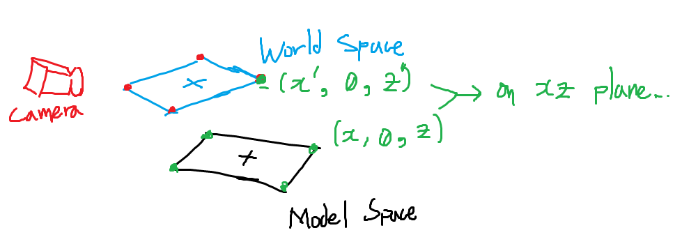  

  당구대의 네 정점 인덱스는 이미지 상에서의 위치에 따라 다음의 두 경우 중 하나로 할당됩니다(적어도, 정점의 반시계 방향 정렬은 보장됩니다). 따라서 아래와 같이 직사각형의 두 대각선 방향 벡터의 합의 단위 벡터를 구하면 직사각형의 방향을 점을 정렬할 필요 없이 계산해낼 수 있을 것으로 보입니다.  

  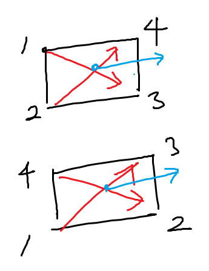  
  
  **13:26**
  
  생각해보니 위 그림은 조금 잘못됐는데, 고정된 순서(1->3, 2->4)로 벡터 두 개를 만들면 점의 순서가 달라질 때 두 벡터의 평균 또한 달라지게 됩니다.

  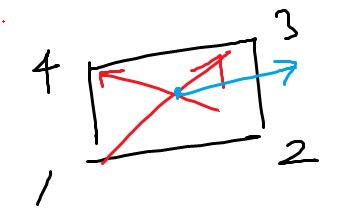
  
  맞는 그림은 위와 같은데, 따라서 당구대의 긴 변을 향하는 방향 벡터를 올바르게 구하기 위해서는 먼저 두 대각선 벡터 사이의 각도를 계산, 90도보다 크다면 두 벡터 중 하나의 방향을 반전시키는 등의 방법을 적용할 필요가 있어 보입니다.

**경과**

- **18:07**  
     
  위 방법을 통해 꽤 안정적으로 당구대의 위치를 추적할 수 있었습니다. 단, stereo vision에 기반한 3d reconstruction 자체의 한계로 당구대 표면처럼 색상이 균일한 평면에 대한 깊이 추정이 제대로 이루어지지 못하고, 이로 인해 당구대 표면에 대한 Z order가 잘못되어 당구대를 나타내는 메쉬가 이리저리 먹히는 현상이 발생하고 있습니다. 향후 Unity Shader에서 당구대 영역만을 마스킹해, 해당하는 부분의 깊이 값만을 override하는 등 개선할 방법을 찾아보아야 하겠습니다.

## 200825-1826

**목표**
- 간단한 필터링을 통해 당구대의 트랜스폼을 안정화시킵니다.

**경과**
- **20:54** LPF를 적용함에 따라 당구대의 위치가 어느정도 수렴하게끔 만들 수 있었지만, 다소 부정확한 3D 깊이 맵에 의존했기 때문에 잘못된 위치로 수렴하는 경우가 더 많은 것 같습니다.

**내일의 목표**
- 테이블의 2D Contour 좌표 순서를 3D 위치를 바탕으로 재정렬한 뒤 solvePnP를 적용해볼 계획입니다. 깊이 값에 의존하는 것보다는 더 높은 정확도를 제공할 것으로 기대합니다.

**(추가) 장기 목표**
- 당구대 인식에 어느 정도 끝이 보이고 있습니다. 다음은 당구공 인식을 구현해야 하는데, 먼저 원근법을 바탕으로 당구공 중점까지의 거리를 추정하고, 이로부터 카메라 공간상의 좌표 $\bar{P}$를 구한 뒤 여기에 카메라 트랜스폼을 곱하는 방법을 시도해보고자 합니다.
- 당구공 인식을 어느 정도 구현한 뒤에는 큐대 방향 인식을 구현해야 하는데, 당장은 뾰족한 방법이 떠오르질 않네요 ... 조금 더 고민해볼 문제입니다.
  
  
## 200826-1247

**경과**
- **12:47** 테이블의 2D 평면 상에서의 contour가 항상 정해진 순서가 되게끔 정렬한 후 solvePnP 함수를 적용하니 확실히 안정성이 늘었습니다. 여전히 4~50cm정도의 오차를 내는 다른 candidate를 반환하는 일이 간혹 있는데, 이 경우에는 3D 포인트를 활용한 추정값을 반환하는 것으로 합의를 봅니다.   
사실 진짜 문제는 생각보다 오큘러스 리프트의 추적 품질이 별로라는 점입니다 ... 아마도 센서가 두 개뿐이고, 테스트 과정에서 계속해서 센서를 등지는 모양새가 되어 오차가 생기는 것으로 보이는데 ... 센서를 몇 개 더 구할 방법이 있다면 좋겠네요.

## 200826-1339

**목표**  
- 당구공 위치를 탐색하는 알고리즘을 고안합니다.

**상세**  
당구공은 반드시 당구대 위에 존재하므로, 앞서 구한 당구대의 사각 영역을 마스킹하고 ROI를 설정한다면 탐색에 걸리는 시간을 조금 줄일 수 있습니다.  
문제는 2D 이미지로부터 당구대를 찾지 못한 경우인데, 이 때에는 이전에 캐시된 당구대의 월드 트랜스폼과 회전 값을 이용해 당구대의 네 컨투어에 대한 추정 위치를 반환합니다. 오큘러스 리프트의 위치 트래킹이 정확한 한, 당구대가 움직일 일은 없으니 어느 정도 신뢰할 수 있을 것입니다.  
이후 해당 ROI에서 당구공을 찾는 것이 관건인데, 당구공 자체를 감싸는 원 자체는 여러 방법을 통해 계산할 수 있지만 당구공의 정확한 중점을 찾기 위해서는 창의력을 다소 발휘해야 할 듯합니다.

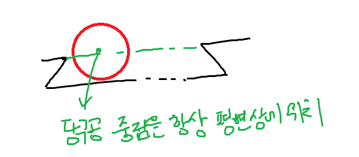

당장 떠오르는 방법은, 카메라에서 이미지 상 당구공의 중점 방향으로 raycast를 수행하고, 당구대 표면과 접하는 지점을 찾는 것입니다(당구공은 평면 위에만 있으니까요).

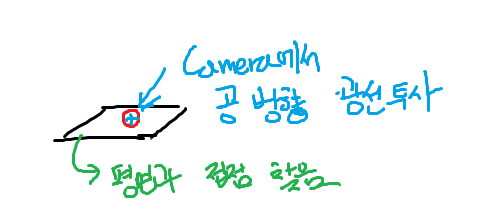

**17:29**

방금 재 보니 당구대의 쿠션이 정확하게 당구공의 중점과 접하는 것은 아니나, 이미 당구대 평면을 찾아낸 만큼 평면의 위치를 약간 오프셋하면 되는 문제입니다.

사실, 당구대 평면을 찾을 때 수 밀리미터 단위의 정확도가 나오는 것도 아니니 기우에 가깝지만 말입니다...

**경과**
- **18:21** 3D 월드 지점을 평면상에 어떻게 투사할지 고민하고 있었는데, 다행히도 OpenCV에서 간편한 방법을 제공합니다; [`cv::projectPoints(...)`](https://docs.opencv.org/2.4/modules/calib3d/doc/camera_calibration_and_3d_reconstruction.html#void%20projectPoints(InputArray%20objectPoints,%20InputArray%20rvec,%20InputArray%20tvec,%20InputArray%20cameraMatrix,%20InputArray%20distCoeffs,%20OutputArray%20imagePoints,%20OutputArray%20jacobian,%20double%20aspectRatio))
- **19:44**   
  
당구대가 시야에서 어느정도 벗어난 상태에서도 위치를 추적할 수 있게 되었습니다. 단, 조금씩 위치가 어긋나는 것은 얼마간 트랙킹 오차로 보입니다.  
또한 간헐적으로 라인이 튀는 현상이 보입니다. 프로젝션 과정의 오류 같은데, 이를 해결하기 위해서는 따로 시야 절두체에 대한 컬링을 수행해야 할 것 같습니다 ... 만 제 역량으로 할 수 있는 일일지는 모르겠네요..
- **21:04** 잠시, 회전 추정의 정확도를 높이기 위해 solvePnP의 rvec을 활용하려 해봤는데, 몇 번을 해봐도 rvec이 엉뚱한 값을 내놓습니다 ... 이유를 모르겠네요 ...
- **22:46** 일단 지금까지의 방법으로 어느정도 정확도를 확보할 수 있었고, 현재 오큘러스 리프트의 트래킹 성능이 유일한 drawback이므로, 테이블 위치 추적은 이 정도 선에서 마무리하기로 합니다. 

**내일의 목표**
- 기하학 공부도 할 겸, 절두체 커팅을 구현해 봅니다. 3D 렌더링을 하는 것이 아니기 때문에 far, near 평면은 고려하지 않고, 시야 사각뿔의 네 평면을 바탕으로 당구대 다각형을 culling합니다. 

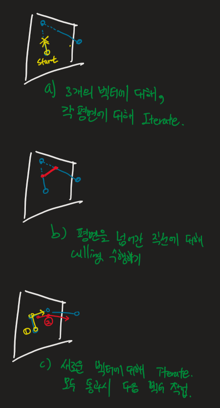

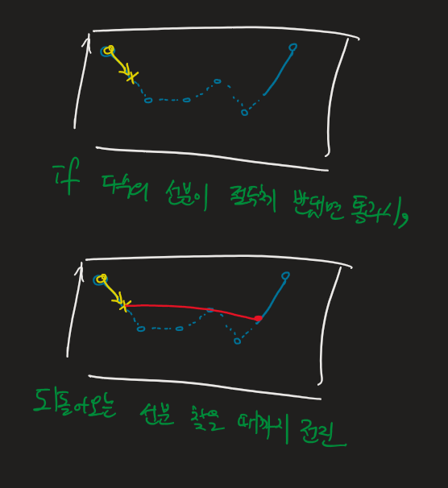

## 200827-1340

**목표**
- 당구대가 인식되지 않은 상태에서, 당구대의 캐시된 위치를 바탕으로 당구대 영역을 식별합니다. 이 때 시야를 벗어난 contour를 프로젝션하면 크게 잘못된 위치를 가리키는 경우가 있으므로, 절두체 컬링을 수행해 당구대의 contour 프로젝션을 시야 내로 한정합니다.

**상세**  
공간에서 평면의 방정식은 $ax+by+cz+d=0$과 같은 식(또는, $\vec{N}\cdot(\vec{P}-\vec{P3})=0$)으로 표현되는데, 시야 사각뿔의 네 평면은 반드시 원점(카메라 위치)을 지나므로 $d=0$이며, 각 평면의 노멀을 구하는 것이 관건입니다. 정확한 방법은 잘 모르기 때문에 적당한 휴리스틱을 동원하자면, ZED 카메라의 수평 시야각이 90도, 수직 시야각이 60도이므로 각각 전방을 향해 45도와 30도 기울어진 평면 노멀을 계산하면 될 듯합니다.  
이후에는 위 그림에서 확인할 수 있듯이 평면을 통과해 나가는 직선과 통과해 들어오는 직선을 찾아 병합하는 과정으로, 적당히 구현하면 될 듯합니다.

**경과**
- **16:12**  
  
Frustum culling을 한 방에 구현해버리고 말았습니다... 스스로의 잠재력이 두려울 정도입니다(농담)  
이제 당구대가 시야 내에 없더라도 ROI를 얻어낼 수 있게 되었습니다.

## 200827-1703
**목표**
- 당구공의 중점을 찾습니다.

**경과**  
- **17:38** 우선 에지 검출 및 허프 트랜스폼을 활용한 방법을 고려해 보았으나, 단순한 색역 필터링만 갖고서는 당구대의 음영, 카메라 왜곡 등으로 인해 깔끔한 구체를 획득하기가 어려워 보입니다.  
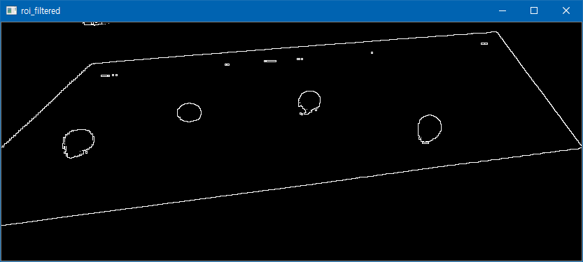  
하지만 인터넷 상에서 cv::HoughCircles 함수 레퍼런스를 찾아보니 OpenCV의 알고리즘은 꽤 다향한 형태의 원형에 대응을 하는 것 같아, 일단 시도라도 해보기로 했습니다.  
[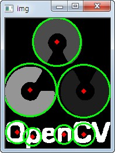](https://opencv-python.readthedocs.io/en/latest/doc/26.imageHoughCircleTransform/imageHoughCircleTransform.html)
- **18:07** 택도 없엇습니다. Threshold를 아무리 낮춰도 제대로 안 잡히는 것도 문제지만, 무엇보다 hough circles의 퍼포먼스가 무섭습니다... 조금 더 경제적인 알고리즘이 필요해 보입니다.
- **18:34** HLS 필터링은 하필 당구대의 색역인 H가 0과 180 양쪽에 걸쳐 있어 필터링이 까다로웠고, 대신해 사용한 YUV 기반 필터링은 비직관적이고 노이즈가 꽤 심했습니다. 그런데 방금 HSV 색공간이 OpenCV에서 지원된다는 것을 알았습니다. HLS보다 메이저하구요. 필터링 방법을 바꿔봅니다.
- **19:12** 잘못 알았습니다. HSV의 파랑색 색역도 역시 0~180 사이에 걸쳐 있네요 .. 
- **20:26** 조금 복잡한 필터링 방법을 적용해, YUV보다 만족스러운 결과를 얻을 수 있었습니다.
- **20:47** HoughCircles 함수의 사용은 당분간 보류하고, findContours 함수 및 contourArea 함수를 활용해 당구공 영역을 찾아볼 계획입니다.
- **00:20** solvePnP함수의 primitive한 버전을 직접 구현했습니다. 당구대의 회전은 y축에 고정되어 있기 때문에, 0~180도까지 2도의 offset으로 회전시키며 가장 작은 오차를 찾는 방식입니다. 물론 얼마든지 더 세련된 방법이 존재하겠지만, 당장 빠르게 구현할 수 있는 방법을 택했습니다 ...

## 200828-1311

**목표**
- 당구공의 이미지 상 중점을 찾습니다.

**경과**
- **13:11**  
    
  위에서 당구대를 검출하는 데 사용한 테이블을 재활용했음에도, 꽤 만족스러운 결과를 얻을 수 있었습니다. HMD의 헤드 트래킹이 정확하게 유지되는 한, 당구대의 위치를 이미지로부터 검출할 수 없을 때에도(즉, 저장된 위치 데이터를 사용할 때에도) 당구대 영역을 올바르게 인식하고 당구공의 중점을 찾아내고 있습니다.  
  당구공 검출에는 findContour 함수를 contour hierarchy를 구성하게끔 하여 호출하고, 자손이 없는 터미널 셰이프만을 남기는 식으로 구현합니다. 당구공의 중점 검출에는 moments 함수를 활용하고, 반지름
  $$r=\sqrt{\frac{M_{00}}{\pi}}$$
  로 계산합니다. 이 때, $M_{00}$은 컨투어 영역 크기입니다.  
- **14:18**  
  
  당구공 인식을 어느정도 하고 나니, 당구대 자체의 저조한 인식률이 눈에 띕니다. 이대로 가면 당구공의 위치가 고개를 한 번 돌릴 때마다 부르르 떨릴 게 뻔하니, 당구대의 인식률을 조금 더 높일 필요가 있어 보입니다 ...
- **16:34** 마침내 solvePnP 함수를 활용해 카메라 시점에서 매우 정확한 rvec을 얻는 데 성공했지만, 이를 world transform으로 변환하는데 매우 애를 먹고 있습니다...  
  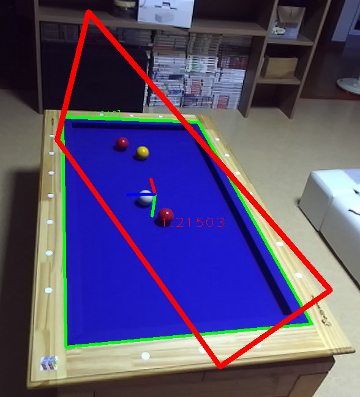  
  초록색 선은 solvePnP의 결과를 다시 화면에 투사한 것으로, 가운데의 좌표 마커 R, G, B 순서대로 x, y, z축을 나타냅니다. 오브젝트의 트랜스폼이 매우 올바르게 찾아진 상태입니다.  
  이상한 폼을 하고 있는 빨간색 상자는 카메라 기준의 오브젝트 위치 및 회전에 카메라 역 트랜스폼을 곱하여 월드 위치로 변환한 뒤, 이를 다시 화면에 투사한 것입니다. 어디서 뭐가 잘못되었는지, 중점의 위치는 알맞으나 회전이 엉망진창이 되었습니다.  
  이 문제만 해결된다면 당구대 추적에서 상당한 정확도를 확보할 수 있을 듯한데, 고민이 더 필요해 보입니다.  
  좌표축 기반의 변환 행렬
  $$ T = \begin{bmatrix} 
  u_x & v_x & w_x & Q_x \\
  u_y & v_y & w_y & Q_y \\
  u_z & v_z & w_z & Q_z \\
  0   & 0   & 0   & 1
  \end{bmatrix}$$
  을 만들어 적용해봅니다.

## 200830-0938

**경과**  
- **09:38** rvec 자체를 회전시키려는 시도가 모두 실패했기 때문에 새로운 방법을 시도해 봅니다 ... 카메라 좌표계 상에서 당구대의 네 귀퉁이에 대한 좌표(위 이미지의 초록 상자)는 구할 수 있기 때문에, 당구공의 네 귀퉁이에 대한 월드 트랜스폼을 구하고, 거기서 모델 좌표에 대한 월드 로테이션을 역산합니다.
- **09:54**  
  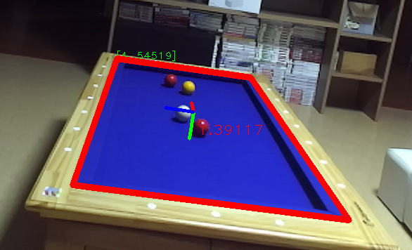  
  당구대의 회전값을 꽤 정확하게 획득했습니다.  
  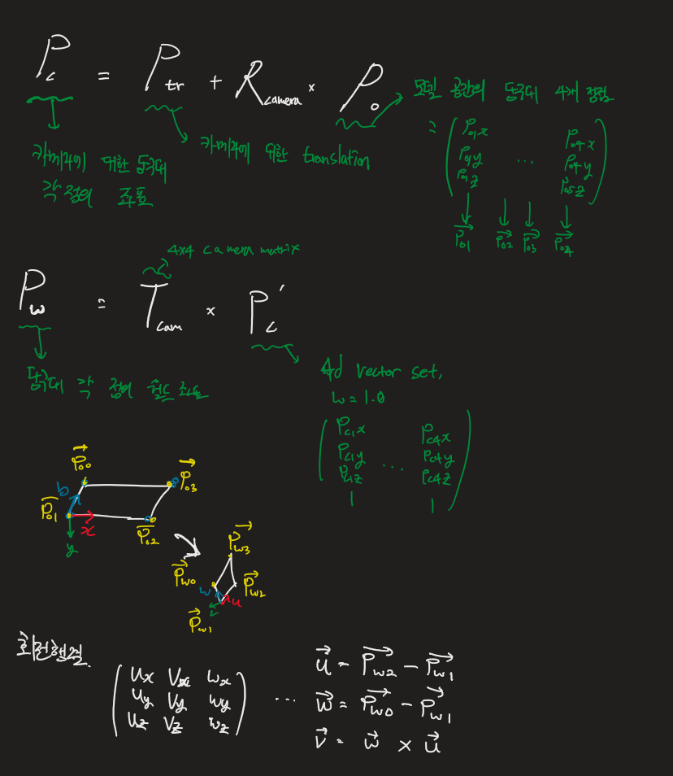  
  즉, 테이블의 rvec 자체를 월드 공간으로 변환하는 데는 실패해서 테이블의 각 점을 월드 공간으로 바꾸고, 해당 점들로부터 변형된 축에 해당하는 $\vec{u}, \vec{v}, \vec{w}$를 계산하여 월드 회전 행렬 $R_{world} = \begin{pmatrix}\vec{u} & \vec{v} & \vec{w}\end{pmatrix}$를 만들었습니다.  
  확실히, 2D 이미지로부터 추정한 회전값은 꽤 명백한 값을 반환합니다.  
    
  하지만 여전히 당구대 좌표를 고정해두고 HMD를 이동할 때는 꽤 취약한 모습을 보입니다. 첫째로 당구대의 추정된 위치 자체가 +- 5cm정도의 오차를 보이는 게 한 이유고, 오큘러스 리프트의 위치 추적 또한 그렇게까지 정확하게 머리의 위치를 추적하는 게 아닌 것으로 보입니다 ... (오히려 ZED 카메라의 트래킹만을 활성화했을 때 더 정확하게 작동하기도 합니다)
  > 당구대의 월드 위치 추정 자체가 오큘러스 리프트의 카메라 행렬을 기반으로 이뤄지기 때문에, 사실 오큘러스 리프트의 추적 결과를 믿지 못하는 시점에서 당구대의 정확한 월드 위치를 획득하는 것은 어렵습니다.  
  
## 200830-1122

**목표**
- OpenCV의 [ArUco](https://docs.opencv.org/trunk/d5/dae/tutorial_aruco_detection.html) 라이브러리를 빌드합니다.

**상세**
화면 상에 당구대가 부분적으로만 나타날 때에도 이미지를 바탕으로 당구대의 정확한 트랜스폼을 지속적으로 추적할 수 있게끔, (즉 이미지 추적이 HMD의 트래킹 트랜스폼으로부터 독립적으로 이루어지게) ArUco 마커를 당구대의 귀퉁이마다 붙여 정확한 트랜스폼을 추적합니다.  

> 비슷한 작업을 당구대 측면의 원형 마커를 통해서도 할 수 있겠지만, 아무래도 색상이 나무의 색깔과 너무 비슷해 조명 환경에 따른 불확실성이 큽니다.

**경과**
- **13:16**   
  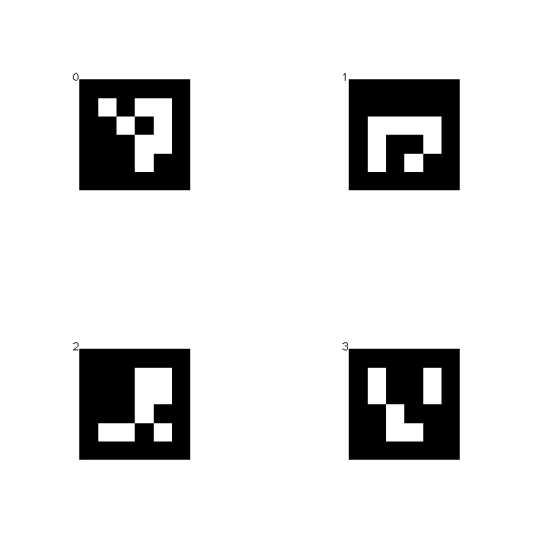  
  ArUco 라이브러리의 마커 인쇄 기능을 통해 표본이 될 마커 몇 개를 인쇄해 당구대에 붙였습니다.
- **13:48** ArUco 함수성을 활용해 포즈를 추정하는 데까진 성공했으나, 기본 설정으로는 거의 130밀리초에 가까운 시간이 소요되는데다 사진 해상도가 낮아 인식률도 그다지 높지 않습니다. 
- **14:48** 당장 사용 가능한 방법 중 ArUco만큼 간단한 방법이 없어 보입니다. 인식률을 높이기 위해 마커의 크기를 늘리고, 속도를 개선하기 위해 몇 가지 간단한 필터링을 통해 ArUco로 추정되는 몇 개의 ROI 영역을 선별하여 detectArUco 함수를 호출합니다.
- **20:58** ArUco 인식의 성능을 높이기 위한 몇 가지 조치를 적용했습니다.  
  1. 당구대의 모서리에 대한 추정 위치를 설정하여, 해당 지점 인근에 ROI를 두어 계산 픽셀 개수 최소화
  2. 검은색 잉크가 옅게 나와, ArUco 마커를 색상 반전하여 인쇄하여 부착

## 200831-1325

**경과**
- **14:36** 계속해서 마커의 월드 트랜스폼이 잘못 잡히는 문제를 겪고 있었는데, 알고 보니 rvec과 tvec의 파라미터 위치를 헷갈린 것이었습니다. 해결하고 나니 정상적으로 마커의 위치가 포착됩니다.  
    
  위 이미지에서와 같이, 당구대 전체가 시야 내에 없을 때에만 마커의 추정 위치에 ROI를 설정하고 디텍션을 수행합니다. 마커의 위치는 고정되어 있으므로, 이 방법을 통해 마커의 월드 위치 및 회전을 얻을 수 있다면, 테이블의 월드 위치와 회전도 얻을 수 있을 것입니다.
- **17:09** 마커의 회전이 지속적으로 정확하게 잡히질 않아 고민이었는데, 알고보니 마커의 회전축이 x축 방향으로 -90도 틀어져서 발생하는 문제였습니다. 
- **17:54** 마커를 로컬에서 회전시켜야 하는데, 회전축을 로컬 x축에서 회전시키는 방법은 안 먹히는 것 같네요 ... 번거롭지만 회전의 u,v,w 성분을 분석하여, 각각의 회전을 순차적으로 적용하는 방법을 사용합니다. 회전 적용 순서는 roll pitch yaw(zxy) 순서.
- **18:08** 위의 접근이 성공했습니다.  
    
  이를 통해 성공적으로 각 마커의 회전을 테이블과 같은 축으로 해석할 수 있게 되었습니다. ... 그러나,  
    
  단일 마커의 출력 결과에만 의존하기에는 출력 포즈의 불안정성이 지나치게 커 보입니다... OpenCV의 ArUco 라이브러리는 강체에 부착된 다수의 ArUco 마커를 활용해 정확도를 높이기 위한 Marker Board 함수성을 제공하는데, 이를 활용해보기로 합니다. [링크](https://docs.opencv.org/master/db/da9/tutorial_aruco_board_detection.html)
- **18:55** 1~2개의 마커만을 이용해 마커 보드를 활용하기는 다소 어려움이 있어 보입니다 .. 일단 마커 보드를 활용하는 아이디어는 접어둡니다.
- **19:02** 마커의 회전 오차 보정을 꺼 봅니다.
- **19:51**  
    
  테이블의 보고된 마지막 회전값을 이용캐 마커 위치를 오프셋하여 테이블의 추정 위치를 구하는데, 이는 오큘러스의 불안정한 위치추적을 제법 잘 보정합니다. 
  
**다음 목표**  
앞서 테이블 edge 정보로부터 컨투어를 구하여 계산한 당구공 정보는 겹쳐 있는 당구공 두 개를 한 개로 인식해버리는 문제가 있었습니다. 따라서 컨투어 정보를 ROI를 추출하는 데만 활용하고, 구체적인 공의 위치는 Hough 변환을 활용 시도합니다.  
앞서 언급했듯, hough 변환을 커다란 이미지에 곧바로 적용하기에는 연산량이 지나치게 많기 때문입니다.

## 200901-1427

**경과**
- **17:16**  
    
  당구대 이미지로부터 당구대의 파란색 면에 해당하는 마스크를 빼주었더니, 손쉽게 당구공의 경계를 포착할 수 있게 되었습니다.
- **19:20** 잠깐 사이드로 빠져서, 테이블 인식 정확도를 높였습니다. 기존에는 검출된 위치를 검증하기 위해 ZED 카메라로부터 획득한 depth 이미지와 비교하였는데, 이를 계산된 회전과 위치값을 다시 화면에 투사하여, 검출된 정점과의 오차를 비교하는 방법으로 변경하였습니다. 또한, 컨벡스 헐을 이용, 어느 정도 테이블을 침범하는 물체가 있는 경우에도 여전히 테이블 위치를 추적 가능합니다.  
    
  위 이미지에서, 초록색 경계선은 테이블의 네 귀퉁이로부터 가장 정확한 위치와 회전값을 획득했음을 나타냅니다. 움짤에서 볼 수 있듯, 당구 큐대로 어느 정도 당구대 영역을 침범했을 때에도 당구대 위치가 일관되게 포착됩니다.  
  오차의 문턱값은 상당히 낮은 값으로 설정되어 있어, 대체로 잘못된 추정은 무시할 수 있습니다.
  
  
## 200906-1311

**경과**
- **13:11** 매번 사소한 파라미터를 변경할 때마다 재컴파일 후 실행하는 것이 꽤 번거로워서, 간단한 ui framework인 [cvui](https://dovyski.github.io/cvui/)를 도입했습니다.  
    
  이를 통해 각종 영상 처리 파라미터를 런타임에 수정하고, 내보내거나 읽어들일 수 있게 되었습니다.
- **16:20** 당구공 각각의 경계선을 검출해 변환으로 원을 모두 찾아내 당구공 각각의 정확한 중점을 구하고자 합니다. 

## 200907-1309

**경과**
- **13:09** 당구공 표면이 스페큘러가 높아 에지 검출에 애를 먹고 있습니다 ... 

## 200909-1426

**경과**
- **14:26** 당구공의 중점을 찾기 위해 당구공을 색상별로 필터링하고, 필터링 된 바이너리 이미지의 경계를 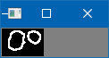과 같이 조금 두껍게 구한 뒤, 여기에 Hough 변환을 다각도로 적용해 보았습니다. 그러나 어떻게 해도 Hough Circles 함수로는 불안정한 에지로부터 제대로 된 원형을 찾아내기가 어렵습니다.
- **14:35** 당구공의 반지름은 정해져 있고, 각 중점에 대한 광선 투사를 통해 당구공의 화면 상 직경 또한 유추할 수 있으므로 적당한 휴리스틱을 통해 occlusion이 가장 적어지는 지점을 선택하고자 합니다.   
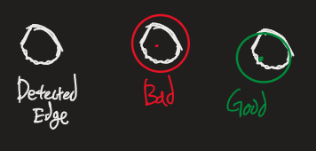  
이 때, 위 그림과 같이 단순히 중점에 대한 RMSE를 통해 계산하는 경우, 잘못된 무게 중심이 계산될 확률이 높으므로 여러 후보를 검토해, 에러가 적은 픽셀이 가장 많은 후보를 채택하는 식의 휴리스틱을 구현해야 합니다. 에러가 적은 픽셀에 대해 역으로 가중치를 주어 가장 높은 가중치를 가진 후보를 택하는 방법이 좋아 보입니다.

## 200911-1112

**목표**
- 당구공을 인식합니다.

**상세**
1. 컨투어 무게중심 측정
2. 임의의 중점 후보 2D 좌표 선택
    해당 2D좌표를 깊은 Z값에 대한 임의의 카메라 좌표로 바꾸고, 카메라 기준 당구대 평면에 대해 투영하여 실제 컨택트 획득, Z 값으로부터 당구공의 픽셀 반경 계산.
3. 적합성 검사 수행
    1. 임의 개수의 컨투어를 선정합니다(최적화).
    2. 픽셀 중점과 반경을 활용해 각 컨투어와 원의 경계선 사이의 유사도를 계산하고, 가까울수록 높은 가중치를 부여합니다. 컨투어는 불완전한 반원 형태로부터 추출되므로 이상치를 벗어난 점들은 큰 의미가 없기 때문에 RMSE는 사용하지 않습니다.
    |  같은 맥락에서, 에러가 가장 적어지는 점이 아닌 가중치가 가장 큰 점을 선택하게 됩니다.
4. 2에서 선택한 중점 후보 중 가장 가중치가 높은 점을 선택하고, 반경을 반으로 줄여 다시 중점 후보를 선택합니다.
5. 2~4의 과정을 정해진 횟수만큼 반복합니다.

**경과**
- **0911.10:35** 테이블 평면을 카메라 기준으로 좌표 변환하는 함수 구현
- **0911.11:15** 거리에 따른 픽셀 반경 계산 함수 구현. 동작:<br>  
- **0913.09:31** 공의 위치 탐색할 때, 각 컨투어와 중점 후보 사이의 연관성을 계산하는 함수 ... 
  $$\text{weight }W = \sum_{n=1}^{N}{b^{-D(P_center, P_contour)}}$$ 
  (단, 함수 $D$는 두 점 사이의 거리, 밑 $b$는 가중치 상수, N은 컨투어 개수)  
  를 사용.  
  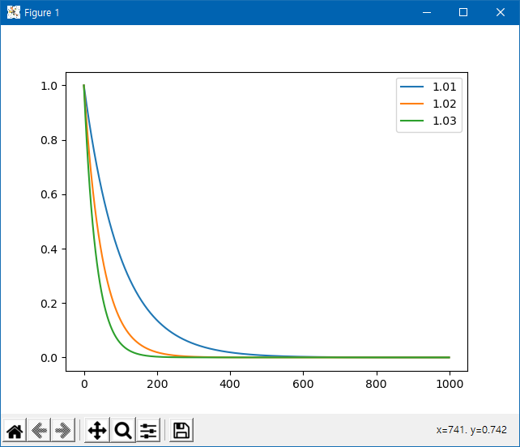  
- **0913.13:13**  <br> 알고리즘 자체는 뜻대로 구현되었지만, 잘못된 후보가 더 높은 적합성을 보이는 문제가 있습니다. 즉, 두 가지 공의 에지 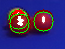 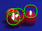 모두 높은 적합성을 보여, 후보가 결정되지 못하는 것입니다.  
  따라서, 정확한 구의 위치를 추정하기 위해서는 색상 또한 고려할 필요가 있어 보입니다. 매 iteration마다 추정 영역의 픽셀을 대상 색상과 하나하나 비교하는 것은 다소 효율이 떨어지므로, 평균 반지름의 절반 정도 되는 커널을 필터 색상으로 채우고 컨볼루션을 수행해 원의 추정 중점 위치에 대한 색상 가중치의 룩업 테이블을 생성합니다. (`cv::filter2D()`)
- **0913.23:03**  컨볼루션을 이용해 색상 유사도를 구하는 함수를 구현해 적용해 보았지만, 역시 당구공의 위치를 안정적으로 검출하진 못했습니다. 
- **0914.15:23** 다수의 파라미터 조정을 통해 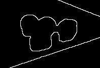와 같이 경계선이 꽤 겹쳐 있는 상황에서도 어느 정도 동작하게 되었습니다. <br>  <br> 다만 위 이미지처럼 이따금씩 두 개의 엔터티가 잡히는 경우가 있는데, 이 부분은 필터링 값을 좀 더 정교하게 튜닝하는 것으로 해결할 수 있을 듯합니다. 흰 색 공의 Hue 값이 애매하다보니, 다른 공의 영역까지도 흰색으로 잡히면서 생기는 문제 같습니다.
- **0914.16:58** 색상 가중치는 HSV 색공간에서 커널과 대상 색 공간의 유사도 합을 활용해 계산합니다. 이는 면적이기 때문에, 거리의 제곱으로 나눔으로써 거리에 관계없이 constant한 가중치 값을 얻을 수 있었습니다. 무슨 기준으로 계산되었는지는 나중에 자세히 알아봐야 하겠지만, 대략 300~ 350정도의 가중치가 가장 높은 수치로 보입니다.
- **0914.23:00** 공의 위치를 추정한 다수의 후보 중 각 색상 별로 가장 높은 가중치를 가진 후보를 택해 JSON serialize, 유니티 엔진으로 전송합니다. 값의 확인은 내일 해볼 예정입니다 ...
- **0915.19:15** 공의 위치를 유니티 엔진으로 보내 표시하였습니다. <br>  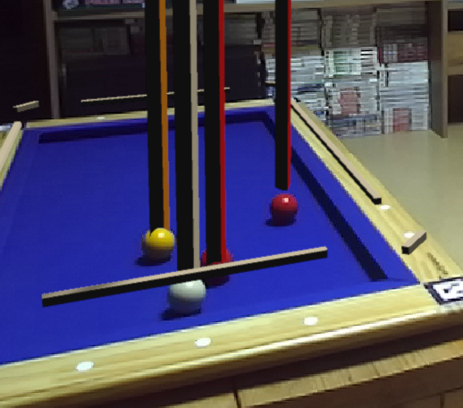 <br> 테이블 평면으로 광선을 투사해 공의 3D 중점을 구하는 알고리즘이므로, 시야가 변할 때에도 꽤 안정적으로 공의 위치가 유지됩니다.
- **0915.22:55** 위치 검출의 최적화 작업(중복 계산 제거 및 일부 연산 GPU로 돌림)을 수행하고, 당구 테이블의 깊이 값 불안정 문제를 해결했습니다. 복잡한 방법은 쓰지 않고, 단순히 선명한 파란색을 띠면 깊이 값을 0으로 고정하는 식입니다. *(파란색 옷을 입은 사람과 마주치지 않기를 바라야죠...)*  
<br> 난잡하게 날아다니는 큐브들은 무시하고, 제법 안정적으로 공의 위치를 트래킹합니다. 데이터를 전송하고, 받아오는 시간이 있어 다소 딜레이가 존재하는데, 이는 이펙트를 '쫓는' 게 아닌 '꼬리를 남기는' 방향으로 설정하여 가능한 위화감을 줄일 계획입니다.
- **0916.11:56** 획득한 당구공의 위치 데이터를 통해 당구공의 속도를 추정, 위치를 보정합니다. 이를 통해 꽤 자연스럽게 당구공의 위치를 트래킹하게 되었습니다. <br>  <br> 조금만 더 하면 충돌도 획득할 수 있을 것 같네요.

## 200916-2100

**목표**  

당구공의 경로를 계산합니다. <br><br>

**상세**  

곧장 큐대의 방향을 인식하는 로직을 짜고 싶었지만, 두 가지 이유로 착수하지 못했습니다.

1. 당구대 인식이 너무 불안정합니다.
     > 당구대 전체가 시야에 들어오는 상황에서는 제법 잘 인식하며, 당구공의 위치도 꽤 안정적으로 잡힙니다. 그러나 무슨 이유에선지 Oculus Rift에서 리포트된 위치는 ZED 카메라의 캡쳐를 통해 보이는 AR 화면과 조금씩 어긋나는 문제가 있고, ZED 카메라의 내장 IMU를 활용한 트래킹은 오차 누적에 의해 안정성이 형편없습니다. 
2. 1에 의해, 시야 위치가 바뀐 경우 테이블 상에서의 당구공 좌표도 신뢰할 수 없습니다. 

위 두 가지 사안으로 인해, 큐대 인식 자체에 성공하더라도, 당구공을 치기 위해 시선을 옮긴 시점에서 테이블의 위치와 당구공의 위치 모두를 신뢰할 수 없게 됩니다. 이 상황에서 큐대의 방향에 기반한 경로 추정은 큰 의미를 갖기 어렵습니다.

모쪼록 멀고 험한 길이 될 큐대 인식의 구현 및 완성에 앞서, 보험 삼아 상대적으로 확실한 정보를 활용할 수 있는 당구공의 경로 분석을 구현하기로 했습니다.

구체적인 알고리즘은 짜 봐야 알겠지만, 대략 다음의 절차로 진행할 예정입니다.

1. 각 당구공의 위치를 테이블 중심에 대해 ZX 평면 좌표로 변환(테이블 월드 트랜스폼으로 역변환)
2. 임의의 방향 및 파워로 물리 시뮬레이션 다수 수행
   1. 회전 및 회전 마찰에 의한 속도 감쇠를 고려하지 않는 단순 충돌 모델입니다. 당구공 속도의 감쇠는 충돌 발생 시 탄성 계수에 의한 감쇠만 고려합니다.
   2. 시분할 시뮬레이션이 아닌, 각 당구공에 대한 sweep trace를 반복하여, 충돌이 검출될 때에만 시간을 진행시키는 이벤트 기반의 시뮬레이션입니다. 
   > 이동하는 구와 이동하는 구 사이의 충돌 검출 --> Swept Sphere Intersection 알고리즘   
   이동하는 구와 정지 평면(쿠션) 사이의 충돌 검출 --> 구에서 평면으로 수선의 발, 구와 수선의 발 교차점에서, 구의 속도 벡터 방향으로 직선-평면 교차 알고리즘 적용
   
   > 충돌 물리 연산 --> [위키피디아 반발 계수 문서 참조](https://ko.wikipedia.org/wiki/%EB%B0%98%EB%B0%9C_%EA%B3%84%EC%88%98) + 벡터 관련 대학물리학 1 참고
3. 점수가 나는 시뮬레이션(빨간 공 두개 때리고 빡 안남) 선택하여 반환

\+ 추가

이벤트 기반 시뮬레이션에서 감쇠는 고려하지 않을 생각이었는데, 심심풀이로 식을 써보니 모든 당구공의 감쇠 계수가 같다면 복잡하지 않은 감쇠는 적용 가능해 보입니다.

공간 상에서 움직이는 구의 중심은 
$$\bar{Q}_n(t)=\bar{P}_n+\int_0^t{\bar{V}_n(T)}dT$$
로 나타낼 수 있습니다. 감쇠를 적용하는 경우, $\int_0^t{\bar{V}_n(T)}dT = \int_0^t{\bar{V}_ne^{-\alpha T}dT} = \bar{V}_n\alpha^{-1}(1-e^{-\alpha t})$가 됩니다.

이동하는 두 구체 $\bar{Q}_1(t), \bar{Q}_2(t)$가 충돌하는 지점을 알기 위해서는, 두 구체의 좌표 사이의 거리가 두 구체의 반지름을 합한 값이 되는 지점을 찾으면 됩니다.

즉,

<script type="text/javascript" async
  src="https://cdn.mathjax.org/mathjax/latest/MathJax.js?config=TeX-MML-AM_CHTML">
</script>

$$
\begin{aligned}
\lVert \bar{Q}_2(t) - \bar{Q}_1(t) \rVert &= r_2 + r_1 \text{ (단, } r_2, r_1 \text{ 은 각각 두 구체의 반지름)} \\

\bar Q_2 - \bar Q_1 &= \bar{P}_2 - \bar{P}_1 + \alpha^{-1}(1-e^{-\alpha t})\cdot(\bar{V}_2-\bar{V}_1) \\

 &= (\bar P_2 - \bar P_1 + \alpha ^{-1} (\bar V_2 - \bar V_1)) - e^{-\alpha t}(\bar V_2 - \bar V_1) \\

\\ 
A &= \bar P_2 - \bar P_1 + \alpha ^{-1} (\bar V_2 - \bar V_1) \\

B &= \bar V_2 - \bar V_1 \\
\therefore \bar Q_2- \bar Q_1 &= A - e^{-\alpha t}B \\

\\
\therefore \lVert \bar{Q}_2(t) - \bar{Q}_1(t) \rVert^2 = (r_2+r_1)^2 &= (A - e^{-\alpha t}B)\cdot(A - e^{-\alpha t}B) \\

&= A\cdot A - 2e^{-\alpha t} A\cdot B + e^{-2\alpha t}B\cdot B \\

\\
\therefore  B\cdot Be^{-2\alpha t}- 2e^{-\alpha t}& A\cdot B + A\cdot A - (r_2+r_1)^2 = 0 \\
u &= e^{-\alpha t} \\
a &= B \cdot B \\
b &= A \cdot B \\
c &= A \cdot A - (r_2+r_1)^2 \\
au^2-2bu&+c=0\\
\\
u=e^{-\alpha t}&=\frac{-b\plusmn\sqrt{b^2-ac}}{a}
\end{aligned}
$$


이며 $b^2-ac$가 0보다 크거나 같을 때 $u$를 계산할 수 있으며, 이로부터 양수이면서 가장 작은 $t$를 구합니다.

$t$를 알게 되면 정확한 충돌 지점과 충돌 시점의 속도를 획득할 수 있습니다. 모든 시뮬레이션 객체를 반복해 가장 먼저 일어나는 충돌 이벤트의 시간 $t_0$을 찾고, 모든 시뮬레이션을 $t_0$만큼 진행시킨 뒤 물리량 연산을 수행합니다.

계산 과정에서 실수가 없었다면, 잘 동작할 것입니다.


<br>
<br>
<br>


***[GO TO TOP](#영상-인식---일지)***

