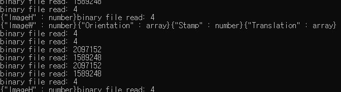

[**HOME**](/README.md)

# 영상 인식 - 개요

- [영상 인식 - 개요](#영상-인식---개요)
  - [당구대 인식](#당구대-인식)
  - [당구공 인식](#당구공-인식)
  - [큐대 인식](#큐대-인식)
- [일지](#일지)
  - [200804-1130](#200804-1130)
  - [200804-1530](#200804-1530)
  - [200804-1630](#200804-1630)
  - [200804-1900](#200804-1900)
  - [200804-2200](#200804-2200)
  - [200804-2230](#200804-2230)
  - [200804-2300](#200804-2300)
  - [200805-1100](#200805-1100)
  - [200805-1130](#200805-1130)
  - [200805-1200](#200805-1200)
  - [200805-1530](#200805-1530)
  - [200805-1630](#200805-1630)
  - [200805-1700](#200805-1700)
  - [200807-0830](#200807-0830)
  - [200807-1000](#200807-1000)
  - [200807-1730](#200807-1730)
  - [200807-2030](#200807-2030)
  - [200807-2130](#200807-2130)
  - [200809-1700](#200809-1700)
  - [200809-1800](#200809-1800)
  - [200810-1630](#200810-1630)
  - [200810-2200](#200810-2200)
  - [200811-1422](#200811-1422)
  - [200811-1946](#200811-1946)
  - [200811-2323](#200811-2323)
  - [200812-1139](#200812-1139)
  - [200812-1654](#200812-1654)
  - [200812-1833](#200812-1833)
  - [200812-2000](#200812-2000)
  - [200812-2318](#200812-2318)
  - [200813-1637](#200813-1637)
  - [200813-1850](#200813-1850)
  - [200813-2005](#200813-2005)
  - [200813-2041](#200813-2041)
  - [200813-2111](#200813-2111)
  - [200813-2137](#200813-2137)
  - [200814-0833](#200814-0833)
  - [200817-1148](#200817-1148)
  - [200817-1416](#200817-1416)

## 당구대 인식

당구대의 쿠션 외각 4개 점을 HSL 색공간에서의 간단한 필터링을 통해 획득하고, 이들로부터 원점에 위치한 당구대에 대한 Perspective Transform을 계산합니다. 계산된 트랜스폼은 카메라 원점으로부터 당구대 평면 노멀의 상대 트랜스폼이 됩니다. 특히, 오큘러스 리프트는 정교한 헤드 트래킹 방법을 제공하기 때문에, 1차적으로 당구대의 위치를 계산한 이후에는 간헐적으로 오차 보정만 수행하고, 오큘러스 리프트의 트래킹에 당구대의 위치를 의존합니다.

간단한 2D 기반 영상 인식 방법이지만, 퍼포먼스가 우수하고 구현이 간단하므로 최우선적으로 도입합니다.

## 당구공 인식


당구공은 단순한 구체이기 때문에 스크린 상에서 간단하게 검출할 수 있지만, 실제로 당구공이 표면에 접한 위치를 찾아내는 것은 꽤 까다로운 일입니다. 깊이 맵 상에서, 당구공 표면의 중점에 대한 정확한 상대 좌표를 알 수 있다면 당구공의 반지름만큼을 카메라 바깥 방향으로 투사해 당구공 구체의 중점을 구하고, 이를 다시 당구대의 법선 역방향으로 투사해 평면에 대한 구의 접점을 구할 수 있습니다.


다만, ZED M 깊이 카메라로부터 획득한 포인트 클라우드의 노이즈가 예상보다 심하다는 게 문제인데, 이 부분은 차차 해결해 나가야 할 것으로 보입니다.

## 큐대 인식

사실상 가장 까다로운 부분인데, 일단 당구공의 포즈는 정적이기 때문에 point cloud상에서 registration을 통해 transform을 추출해내는 방법을 고려하고 있습니다. 

# 일지

## 200804-1130

OpenCV와 ZED SDK, CUDA Toolkit등을 설치 완료하고, 빌드 환경을 구성했습니다.

## 200804-1530


카메라 연결 성공, ZED SDK 내부 데이터 형식인 sl::Mat을 cv::Mat으로 컨버팅하고 cv::imshow 함수를 통해 디스플레이

## 200804-1630

당구대, 당구공 등의 물체는 강한 원색을 띠므로, HSL 색공간으로 전환하고 Hue만을 도출하여 각 물체의 윤곽선을 검출하고자 합니다.


HSL 색공간으로 데이터를 표현하자 당구대의 네 귀퉁이가 선명하게 드러납니다. 그러나 벽면을 보면, Lightness가 높은 흰색 물체라 Hue값의 의미가 없음에도 불구하고 Hue가 보라색으로 잡히고, 검은색 받침대는 파란색이 잡힙니다.


이는 Saturation값만을 표현한 이미지로, 벽면의 Saturation이 정상적으로 연하게 잡히는 것을 확인할 수 있습니다. Hue 값이 0으로 고정되어 있기 때문에 이미지는 전반적으로 파란 톤을 띱니다.

널브러진 흰 티나 당구대의 음영 부분의 Saturation도 100%가 잡히는 문제가 있는데, 이는 Lightness가 0% 또는 100%일 때 Saturation이 100%로 고정되면서 발생하는 문제로, 향후 Lightness가 극단적인 수치를 갖는 픽셀의 Saturation을 0으로 설정하는 처리를 수행할 예정입니다.


이는 Saturation과 Hue를 결합한 이미지로, 한 눈에 보기에도 다른 곳에 비해 당구대의 색감이 강하게 드러납니다. 이 상태에서 Hue를 당구대 색상으로 필터링하면 당구대의 영역을 구할 수 있을 것으로 보입니다.

## 200804-1900

HSL 색공간은 Hue의 cyclic한 특성으로 인해 OpenCV의 내장 필터링 함수(Threshold)로 필터링을 수행하기가 다소 난해합니다. 만약 HSI 채널의 Saturation과 Hue 값을 사용한다면, 이는 사실 YUV, Lab처럼 밝기를 별도의 채널로 빼낸 색공간에서 밝기 채널을 고정시키는 것과 같은 효과이므로, 이들 방법 또한 시도해봅니다.


YUV 색공간에서 Y값을 고정한 이미지로, 각 엘리먼트의 색상을 꽤 명료하게 잡아내지만 당구대의 바깥틀에 가려진 음영 부위의 식별이 다소 모호합니다. 

> 
> <br> FIX: OpenCV에서 따르는 HSL 모델은 위와 같으며, 따라서 Hue는 딱히 cyclic하지 않습니다. 
> <br> YUV의 퍼포먼스가 그다지 뛰어나지 못하다는 것도 확인했으므로, 원래대로 HSL 색공간을 활용합니다.

## 200804-2200


HSL 색공간에서 HSL 값 각각에 대해, $H=[0, 35], S=[180,250], V=[20, 230]$의 값으로 필터링을 수행한 결과입니다.


그러나 카메라의 자동 노출에 꽤 취약합니다.

## 200804-2230


앞서 언급된 자동 노출 문제는, 사실은 [200804-1900](##200804-1900)에서 언급된 Hue의 Cyclic한 특성으로 인한 것으로 판단됩니다. 필터를 낮 은레벨, 높은 레벨 두 번에 걸쳐 걸자 정상적으로 당구대 영역이 검출되었습니다.


앞서 검출된 영역을 원본 이미지와 합성한 결과로, 단순히 마스크를 시각화합니다. 위에서 하늘색 이불이 잘못 필터링되는 문제가 있는데, 이는 차후 다른 색공간에서의 필터링 작업을 통해 교정할 예정입니다.

이 과정까지의 소모 시간은 약 5ms 안팎으로, 1초에 30프레임을 목표로 삼았을 때(33ms per frame) 제법 여유가 있는 수준입니다.


필터 값의 조정을 통해서도 영역의 검출이 가능하지만, 당구대 자체의 영역이 침식되는 문제가 있습니다.  


YUV 색상 기반의 필터입니다. 훨씬 깔끔하게 동작하고, 동작 속도도 20% 개선됩니다. (1ms 단축)


이렇게 생성된 마스크에 침식(cv::erode)과 팽창(cv::dilate) 연산을 반복적으로(iterations:25) 적용한 결과입니다. 당구대 영역이 거의 완벽하게 검출됩니다. 

이 과정에서 추가되는 연산량은 약 1.5ms정도로, 결과물의 품질을 고려하면 꽤 합리적입니다.


단, 팽창-침식 연산 자체의 문제점으로 당구대의 바운드가 경계면에 다가갈 경우 위 이미지와 같이 마스크가 비정상적으로 팽창됩니다. 

하지만 당구대의 트랜스폼 검출 정보는 최초 1회만 수행되고, 이후에는 오류 검출을 위해 confidence가 아주 높을 때에만 위치 보정을 위해 부차적으로 활용되며, 따라서 이미지에서 당구대의 ROI rectangle만 추려낼 수 있다면 반복적인 침식-팽창 연산으로 인한 glitch는 무시할 수 있는 수준입니다.

> 당구대 ROI는 연산 최적화를 위해 고려합니다. 체감상 영상 처리 알고리즘의 퍼포먼스에는 해상도가 미치는 영향이 가장 지배적이었습니다.

## 200804-2300

> NOTE: 현재 Stereo camera의 이미지 중 좌안의 이미지만 활용하고 있는데, 향후 좌안 카메라의 이미지로부터 당구대의 정확한 트랜스폼을 구할 수 있다면, 단순히 좌안 카메라를 상대 좌표계의 원점으로 삼고, 우안 카메라의 원점을 오프셋 시킴으로써 좌안 카메라로부터 검출된 트랜스폼 정보를 우안 카메라에 동기시킬 수 있을 것으로 보입니다. 
>
> 아직까지는 확정된 것이 없기 때문에, 일단 아이디어로써 적어둡니다.

## 200805-1100


컬러 이미지에 검출된 당구대 영역을 ZED의 스테레오 카메라로부터 도출된 깊이 맵 정보로 오버레이한 모습입니다. 


당구대 도형의 네 contour의 정확한 위치 좌표를 알 수 있다면 가장 이상적인 방법으로 정확한 당구대의 위치를 추론할 수 있겠으나, 위 그림과 같이 깊이 맵을 오버레이한 경우 깊이 맵과 컬러 이미지 사이에 꽤 큰 오프셋이 보입니다.

당구공은 거의 통째로 옆으로 옮겨 놓은 수준이라, 실제 활용이 다소 어려워 보입니다.

## 200805-1130


설정 상에 다소 오류가 있었는데, 깊이 이미지와 컬러 이미지 모두 좌안 기준으로 생성되게 함으로써 매칭 이슈가 해결되었습니다. 

여기까지 걸린 전체 프로세스는 약 60 ms 내외로, 깊이 이미지와 컬러 이미지 두 개를 retrieve하면서 퍼포먼스가 굉장히 떨어지게 되었는데, GPU 사용률은 30% 안쪽이고, CPU는 코어 하나만 죽도록 갈구는 상황으로 보입니다.


특히 zed 카메라로부터 이미지를 획득하는 코드의 부하가 높았습니다. 추후 이 구간이 퍼포먼스에 큰 병목이 될 경우, 한 프레임정도의 딜레이를 감수하고 별도의 스레드로 캡처 코드를 빼내는 편이 나을 듯합니다.


나머지 병목은 대부분 UMat을 활용하지 못하는 함수나 UMat-Mat 사이에 데이터를 전송하는 부분에서 발생했습니다. 이 부분의 최적화는 알고리즘을 어느 정도 다듬은 후, 천천히 고민해볼 문제로 보입니다.

> 현재 CPU 코어가 하나만 돌아가고 있는데, WITH_TBB, WITH_OpenMP 등의 플래그를 활성화한 opencv 빌드를 사용해 퍼포먼스를 개선할 수 있을 것으로 보입니다.

## 200805-1200


이미 필터링을 통해 당구대 영역을 바이너리 마스크의 형태로 구한 상태이므로, 단순히 1회 침식한 이미지를 마스크에서 빼줌으로써 간단하게 경계선을 구할 수 있습니다. 


컨벡스 헐 연산을 통해 당구대 영역을 비교적 정확하게 검출할 수 있습니다. 


Contour 개수가 지나치게 많이 잡히는 문제는 apporxPolyDP 함수에 큰 epsilon값을 인자로 주어 해결할 수 있었습니다. 


위 이미지를 보면 여러 거짓 셰이프가 잡히는 것을 볼 수 있는데, 이를 셰이프의 면적과 contour 개수로 필터링합니다.

## 200805-1530

당구대의 perspective를 게산합니다. 여기서는 카메라의 intrinsic parameter등을 고려하지 않고, 간단한 선형 프로토타이핑을 수행합니다. 

> 사실 포인트 클라우드로부터 계산하는 것이 더 간단하게 구현할 수 있지만, 깊이 이미지는 정확도가 십 센치미터 단위로 널뛰기를 해서 일단 2D 방법을 먼저 고려합니다.

ZED는 카메라 오른쪽이 X, 아래쪽이 Y이고 전방이 Z인 오른손 좌표계를 따릅니다. 


위 그림과 같은 방법으로 96x51\[cm\] 크기의 당구대가 1 미터 거리에서 차지하는 시야각을 구하고, 이 값으로 1미터 거리의에서 이미지 중앙에 놓인 당구대가 사진 상에서 차지하는 네 점의 좌표를 구합니다. 이 값이 pivot이 됩니다.

이를 통해 검출된 당구대의 네 contour로 실제 당구대의 perspective를 구할 수 있다면, 해당 perspective matrix를 (0, 0, 1) 좌표에 곱하면 카메라에 대한 당구대의 상대 좌표를 구할 수 있을 것으로 기대합니다.

## 200805-1630


1m 거리에서 당구대를 보았을 때의 네 귀퉁이를 노란색 점으로 오버레이합니다. 


얼추 맞는 것으로 보입니다.


## 200805-1700

Perspective Transform의 용도에 대해 잘못 생각한 것 같습니다.

해당 함수의 의의는 2D 좌표 사이를 매핑하는 것으로, X, Y, Z 트랜스폼과 3개 축에 대한 회전 값을 담는 행렬을 반환하는 마술 같은 함수는 아니었습니다.

어쩌다 그런 생각을 하게 됐는지 모르겠네요 ...

<br><br><br>

현재 기준점과 목표 지점 두 가지를 모두 아는 상황이므로, "기준 정점에 변환 행렬을 적용 -> 다시 투영 -> 검출 정점과 변환된 기준 정점 사이의 오차를 비교"하는 프로세스를 반복적으로 적용하며 오차를 좁혀 나가는 방법을 고려해볼 수 있을 듯합니다.

수학적인 기반이 있다면 좀 더 세련된 매칭 방법을 생각해낼 수 있겠지만, 당장은 이 정도가 한계라고 생각됩니다.

일단은 당초 PLAN B로 생각해두었던, ZED 카메라에서 획득한 깊이 데이터를 활용하여 당구대의 위치를 획득하고, 시야가 바뀜에 따라 점진적으로 당구대의 위치를 교정해 나가는 방법을 적용할 계획입니다.

## 200807-0830

ZED SDK는 각각의 픽셀 좌표 u, v에서의 깊이 값으로부터 카메라에 대한 상대 좌표 x, y, z를 얻는 방법을 제공합니다. 위에서 당구대의 네 귀퉁이에 대한 u, v를 이미 계산했으니 이들의 카메라에 대한 상대 좌표를 얻는 것은 간단합니다.


> 간헐적으로 귀퉁이의 점이 NaN을 반환하는 경우가 있는데, 색상이 변하는 지점에서 confidence가 낮게 나타나 픽셀이 반환되지 않은 것으로 보입니다. 향후 인근의 픽셀들의 좌표를 병합해 NaN의 발생 빈도를 줄이는 방향으로 개선할 생각입니다.

이제 카메라의 transform을 활용해 이들의 좌표를 월드 좌표로 매핑해주어야 하는데, 보통 3D 공간의 affine matrix는 $M_{orientation} \times M_{translation}$ (단, 각각 카메라의 회전과 위치)으로 구성되므로, 각 점에는 $M_{translation}^{-1}\times M_{orientation}^{-1}$ 변환 행렬을 곱해주어야 할 것입니다.

상대 좌표에 위치한 포인트를 월드 좌표로 변환하는 동작은 꽤 흔하게 사용되므로, 아마 SDK에서 해당 함수성을 제공할 것으로 생각됩니다.


## 200807-1000


> ZED 카메라가 pose를 잃어버렸거나 당구대가 제대로 인식되지 않았을 때 Overlay가 깜빡입니다. Pose를 잃어버린 경우 외각의 글씨가 사라지고, 당구대를 인식하지 못한 경우 흰색 경계선까지 사라집니다.

일단 ZED SDK에서 카메라 트랜스폼을 얻어, [이 페이지](https://www.stereolabs.com/docs/positional-tracking/coordinate-frames/#world-frame)의 레퍼런스를 따라 단순히 곱해보았는데, 각 점의 좌표가 거의 미터 단위로 발산합니다 ...

ZED 평가용 어플리케이션을 실행했을 때엔 꽤 정확하게 world reconstruction을 수행했기 때문에, 아마도 좌표 변환을 수행하는 방법이 잘못된 것 같네요 ..

그러길 바랍니다 (..)

## 200807-1730

**KEYWORDS**
- Eight-point algorithm
- PnP algorithm

당구대의 크기를 이미 알고 있고, 카메라의 intrinsic parameter 또한 SDK의 도움으로 손쉽게 획득할 수 있습니다. 

교수님의 도움으로 몇 가지 유용한 알고리즘에 대한 정보를 얻었습니다. 위 알고리즘을 통해 이미지 상에 투영된 당구대의 네 귀퉁이로부터, 정확한 extrinsic을 도출해낼 수 있을 것으로 보입니다.

``` c++
vector<cv::Vec2f> FoundContours;
vector<cv::Vec3f> Pivots;
{
    double HalfX = 0.96 / 2;
    double HalfZ = 0.51 / 2;

    // OpenCV 좌표계 참조
    Pivots.push_back({-HalfX, 0, HalfZ});
    Pivots.push_back({-HalfX, 0, -HalfZ});
    Pivots.push_back({HalfX, 0, -HalfZ});
    Pivots.push_back({HalfX, 0, HalfZ});
}

cv::Mat RotVec, TransVec;
cv::solvePnP(Pivots, FoundContours, CameraMat, DistortionMat, RotVec, TransVec, false, cv::SOLVEPNP_IPPE);
```

우리는 평면 상에 위치한 4개의 점을 매칭시킬 것이므로, SOLVEPNP_IPPE를 먼저 시도합니다.


먼저 위 방법을 통해 도출된 Translation Vector(카메라 좌표계)를 당구대 중심에 표기해 보았습니다. 이따금씩 큰 폭으로 진동하는 경우를 제외하면, 대부분 값은 10mm 범위 내에서 수렴합니다. 제가 카메라를 손으로 들고 있어서 바들바들 떨리는 것까지 고려하면, 아마도 진동 폭은 더 작을 것으로 생각됩니다.

이제 이 좌표를 다시 월드 좌표계로 변환해야 하는데, 일단 강체의 회전은 고려하지 않고 translation 좌표만 카메라의 position에 더해 보았습니다.

## 200807-2030

[](https://youtu.be/2kkCd01lM6k)
*클릭하여 재생*

카메라에 대한 테이블의 상대 좌표 $P_{camera}$의 월드 좌표를 구한 식은 다음과 같습니다.

$P_{world} = P_{camera} \times T_{camera}$(단, $T_{camera}$는 카메라 트랜스폼 행렬)

간헐적으로 세 개의 값이 모두 바뀌는 경우(Candidate가 노멀이 위를 향하는 방향, 아래를 향하는 방향으로 총 2개이므로)를 제외하면, 값이 꽤 적은 오차범위(약 5~6cm)에서 수렴하는 것을 확인할 수 있습니다.

이제 노멀이 위를 향하는 방향의 candidate만을 선별하고 LPF를 통해 테이블의 위치를 수렴시키는 방향으로 구현하면 당구대 인식은 어느 정도 마무리할 수 있을 것으로 보입니다.

> NOTE: 정답을 앞에 두고 엄한 곳을 헤매고 있었습니다 ... 앞서 테이블의 포즈를 추정하는 데 사용한 PnP 함수가 두 개의 candidate를 순서 없이 반환해서, 한 번씩 값이 뒤틀리는 것을 보고 위 식이 잘못된 줄 알았었네요.

## 200807-2130


노트: 노멀이 위를 향하는 candidate만 걸러내기 ...

> NOTE: OpenCV의 SolvePNP는 강체의 회전 각도를 회전축(x,y,z)과 각도($\theta$)로 이루어진 Rodrigues 표현법으로 반환합니다. 당구대의 위치를 인식한 OpenCV와 이를 표기할 Unity는 서로 사용하는 좌표계가 달라 회전 좌표계의 변환이 좀 어려울 것 같았는데, Rodrigues 표현법으로 표현된 회전각은 회전축 방향 벡터의 좌표계만 변환하면 될 것으로 보입니다.

## 200809-1700

오큘러스 리프트를 유니티 엔진에서 빌드하기 위한 작업에 들어갔습니다.

1. Oculus App 설치 후 장치 초기 설정 완료
2. Unity 2019.4.7f1(LTS) 설치
3. [빌드 셋팅 문서화](https://developer.oculus.com/documentation/unity/unity-conf-settings/#build-settings)에 따라 프로젝트 설정

이 시점에서 오큘러스 리프트로 화면을 띄우는 것까진 성공했습니다. 그러나 아무것도 설정하지 않은 상태에서는, 헤드 트레킹 등의 기능은 작동하지 않는 걸로 보입니다.

## 200809-1800

오큘러스에서 Unity integration을 위해 제작한 [Occulus Integration](https://assetstore.unity.com/packages/tools/integration/oculus-integration-82022) 패키지를 import합니다.


이후 해당 패키지에서 제공하는 Prefab 중, OVRCameraRig을 활용하면 간단하게 헤드 트래킹을 사용 가능합니다.

이제 ZED Stereo 카메라로부터 이미지를 받아와 AR 장치로 뿌려주면, 기본적인 셋팅은 끝나게 됩니다.

## 200810-1630

OpenCV의 SolvePnP를 통해 획득한 당구대의 좌표를 Unity 엔진에서 확인해봅니다. 

Unity좌표계(OpenCV 좌표계에서 Y방향 반전; 왼손 좌표계)로 변환된 테이블 위치와 Rodrigues 방향 벡터를 TCP 프로토콜로 전송합니다.


C++ 프로그램의 JSON 라이브러리는 [nlohmann/json](https://github.com/nlohmann/json)을 사용합니다.

Socket은 버클리 소켓 API를 그대로 사용하는 대신 깃허브에서 [fpagliughi/sockpp](https://github.com/fpagliughi/sockpp) 라이브러리를 사용합니다.

## 200810-2200

C++ 인식 프로그램에서 라이브러리만 간단히 설정해두고, 유니티 엔진에서 ZED + Oculus를 통해 증강 현실을 먼저 확인해보기로 했습니다. 

Oculus와 ZED 양쪽 모두 간편하게 핸들링 가능한 Prefab을 제공합니다. 

1. 오큘러스 prefab의 계층은 다음 이미지와 같습니다.<br>  <br> 루트 카메라 릭에서 TrackingSpace 더미 오브젝트를 생성하고, 헤드마운트와 양쪽 컨트롤러 위치를 트래킹하는 고정밀도 앵커 오브젝트를 어태치합니다. <br> 위 이미지에서 확인할 수 있듯 좌우 양안 각각에도 앵커가 할당되어 있고, 이대로 사용하는 경우 카메라도 활용 가능하지만 ZED 카메라로부터 캡쳐된 이미지를 알맞게 화면에 채우기가 어렵습니다.
2.  <br>ZED 프리펩으로, 별도로 손대지 않아도 이미 좌우 카메라 캡쳐가 VR 장치의 좌우 양안으로 송출됩니다. ZED 카메라 내부의 트래킹 API를 활용하긴 하지만, 트래킹 성능 자체는 보잘것없습니다.


결과적으로, ZED prefab을 Oculus prefab 안에 중첩시키고, Oculus prefab의 카메라 기능과 ZED 카메라의 트래킹 기능을 끔으로써, ZED 카메라의 영상과 Oculus의 정밀한 트래킹 모두를 취할 수 있었습니다.


ZED Plugin for Unity는 카메라로부터 생성된 깊이 맵으로부터 object의 distance culling 또한 지원합니다. 생성되는 depth map의 퀄리티 자체가 높지 않아 다소 어색함이 있습니다.

> 카메라가 조금 더 광각이었다면 좋았을 듯합니다. 현재로선 카메라의 시야각이 상당히 좁아, 마치 터널을 통해 보는 느낌입니다.

내일은 TCP 소켓을 통해 ZED 카메라의 이미지를 영상 인식 프로그램으로 스트림할 방법을 찾고, 다시 JSON 형식으로 당구대의 월드 좌표를 받아오고자 합니다.

> 
> <br> *~~제드..오...빠...~~ 카메라를 붙이느라, 오큘러스가 누더기가 되었습니다 ...*

---- NOTE ----

* 유니티 --> 영상 인식 프로그램

1. 캡쳐 시점의 좌안 카메라 트랜스폼 (OpenCV 좌표로 변환)
2. 좌안 캡쳐 영상
3. 좌안 깊이 맵 

> 영상 인식 처리가 끝난 시점에 이미 헤드 트래킹은 위치가 변해 있을 확률이 높습니다. 따라서 캡쳐 시점의 카메라 트랜스폼 정보를 동시에 전송하여 영상 인식 프로그램 내에서 당구대, 당구공, 큐대 등 오브젝트의 카메라에 대한 상대 좌표뿐만 아니라, 월드 좌표까지 계산할 수 있게 합니다. <br> 월드 좌표는 현재 트래킹되고 있는 카메라 위치와는 무관하기 때문입니다.

* 영상 인식 프로그램 --> 유니티

> 모든 좌표 변환은 Unity에서 수행합니다. 즉, 영상 인식 프로그램 --> 유니티 방향의 모든 좌표계는 OpenCV 좌표계입니다.

1. 당구대 월드 트랜스폼 (캡쳐 시점의 좌안 트랜스폼에 대해 변환)
2. 당구공 트랜스폼
   1. 당구대 중심에 대한 정규화된 2D 좌표
   2. 월드 트랜스폼
3. 큐대 월드 트랜스폼

## 200811-1422

앞서, 유니티 엔진에서 영상 인식 프로그램으로 캡쳐 이미지를 스트림하기 위해 여러 레퍼런스를 찾다, [이 문셔](https://github.com/stereolabs/zed-unity/issues/61)를 찾았습니다. Zed plugin for unity는 이미 네트워크로 이미지를 스트림할 준비가 되어있는 걸로 보이네요.


다만 유니티 플러그인의 기본 스트리밍 옵션은 대역폭 최적화를 위해 HEVC, 또는 AVCHD 코덱으로 인코딩/ 디코딩 과정이 요구됩니다. 하지만 지금 하려는 것은 loopback address 에 대한 TCP연결을 활용한 IPC이므로, 대역폭은 문제가 되지 않을 것이라 판단됩니다.

OpenCV에서 이미지를 디코딩하는 것도 꾀까다로운 일이고 말이죠 ...

따라서 위 문서에서 소개된 방법 중, 단순히 ZED 카메라의 이미지를 캡쳐해 영상 인식 프로그램으로 스트림하는 방법을 쓰기로 했습니다.

이 경우 영상 인식 프로그램이 리슨 서버 호스트가 되어, 유니티 엔진에서 영상 인식 프로그램에 연결, 이미지와 트랜스폼 정보 등으로 리퀘스트를 보냅니다.

## 200811-1946

너무 한 번에 여러 가지를 하려다보니 오히려 지지부진해졌습니다 ...

최우선적으로, JSON과 TCP IPC를 테스트합니다.


유니티 쪽에서 무사히 데이터를 보냈습니다. 수신 또한 비슷할테니 별도로 테스트를 하진 않았습니다.

위 사진은 받아온 문자열을 그대로 출력한 것으로, 아직 C++ 프로그램 내에서는 파싱이 되지 않은 상태입니다.

## 200811-2323

계속해서 원인을 알 수 없는 에러로(Error code == 0) socketpp 연결을 유지하지 못하는 상태였는데, socketpp 함수 호출 사이사이에 thread::sleep을 끼워넣어서 가까스로 해결할 수 있었습니다.

## 200812-1139

전날 sockpp의 원인을 알 수 없는 에러와 모호한 문서화로 한동안 삽질을 하다가, 결국 Boost 라이브러리를 쓰기로 결정했습니다. 이쯤 오니 얌전히 기본 소켓 API를 쓸걸 그랬다는 생각도 드네요 ...
  
## 200812-1654

한나절 가까이 삽질한 끝에, Boost.ASIO를 활용하는 멀티스레드 비동기 TCP 서버 클래스를 작성했습니다. 

사실 비동기와 멀티스레드는 필요 없는 항목이었지만, boost 공부를 할 기회 삼아 이것저것 다 쓰까 보았습니다.

[코드 보기.hpp](https://github.com/kang-sw/ArBilliards/blob/master/Projects/CoreModel/Recognition/include/tcp_server.hpp)
<br>[코드 보기.cpp](https://github.com/kang-sw/ArBilliards/blob/master/Projects/CoreModel/Recognition/src/tcp_server.cpp)

## 200812-1833

JSON, TCP IPC가 모두 준비되었으므로, Unity에서 Zed 카메라의 이미지를 복사해 c++ 프로그램으로 전송합니다. 

``` C#

if (Pixels == null)
{
  Pixels = Zed.zedCamera.CreateTextureImageType(VIEW.LEFT);
}
if (Depths == null)
{
  Depths = Zed.zedCamera.CreateTextureMeasureType(MEASURE.DEPTH);
}

JsonObj.ImageW = Pixels.width;
JsonObj.ImageH = Pixels.height;
JsonObj.Pixels = Convert.ToBase64String(Pixels.GetRawTextureData());
JsonObj.Depths = Convert.ToBase64String(Depths.GetRawTextureData());

```

`Zed.zedCamera.CreateTextureImageType` 메서드를 통해 매 프레임 ZED 카메라의 이미지로 갱신되는 텍스쳐 레퍼런스를 획득할 수 있습니다. 이를 Base64 인코딩해 전송합니다.

## 200812-2000

Base64 인코딩으로 이미지를 전송하는 데까지는 성공했지만, 루프백 어드레스를 통해 데이터를 전송함에도 불구하고 1초에 한 프레임을 전송하기가 어렵습니다 ... 


확인해보니 루프백 대역폭 문제는 아니었고, 대부분의 cpu 시간이 입력된 json 문자열을 파싱하는 데 소모되기 때문으로 보입니다.


## 200812-2318



몇 시간 동안이나 소켓과 씨름한 끝에, 가까스로 바이너리 스트림과 json 스트림을 분리할 수 있었습니다. 연결이 끊어진 TCP 소켓은 값을 써보기 전까지는 연결 해제 여부를 알 수 없다는 것도 알았네요 ...

내일은 바이너리 스트림과 이미지 요청 스트림의 데이터를 동기화하고(timestamp로 구별), 과연 제대로 캡쳐가 이루어졌는지 확인해보아야 하겠습니다.

## 200813-1637


Json 스트림과 바이너리 스트림을 동기화하는 데 성공했습니다. 

``` c++
struct image_t
{
    cv::Vec3f translation;
    cv::Vec3f orientation;
    cv::Size image_size; 
    cv::Mat rgb;
    cv::Mat depth;
};
```

전송된 두 스트림은 위와 같은 형식으로 병합됩니다.

## 200813-1850

유니티 엔진에서 ZED 카메라의 출력을 Texture2D로 받아올 수 있는데, Texture2D는 메모리가 GPU에 할당되어있기 때문에 이를 CPU로 받아와야 했습니다. 

```c#
Texture2D.GetRawTextureData()
Texture2D.GetPixels()
Texture2D.EncodeTo[JPG|PNG]()
```

등의 함수를 사용해 보았지만 하얀색 버퍼만 읽혔는데, 아래의 함수를 찾았습니다.

```C#
Rendering.AsyncGPUReadback.Request()

...

var PixelReadRequest = AsyncGPUReadback.Request(Pixels);
var DepthReadRequest = AsyncGPUReadback.Request(Depths);
AsyncGPUReadback.WaitAllRequests();

var PixelBuf = PixelReadRequest.GetData<byte>();
var DepthBuf = DepthReadRequest.GetData<byte>();
```

이 함수는 비동기적으로 Texture2D의 바이트 청크를 CPU로 읽어오는데, 이 시간은 매우 짧기 때문에 WaitWallRequest()로 동기적으로 대기해도 무방할 것으로 보입니다.

아무튼, 이 함수를 써서 가까스로 ZED 카메라의 캡처 데이터를 읽어들일 수 있었습니다.


## 200813-2005


이는 깊이 이미지를 캡쳐한 것으로, 일단 동작 확인을 위해 넣어두었습니다.

<br>*사진에서 중앙에 위치한 것이 카메라고, 바깥쪽에 위치한 것이 오큘러스 트래킹 모듈입니다. 두 오브젝트는 서로 계층 구조로 연결되어 있음에도, 미세한 랙이 발생합니다.*

위에서 캡쳐 및 전송 동작을 동기적으로 수행하고 있는데, 이게 꽤 부하가 되는 걸로 보입니다. Update() 동작에서 병목이 생긴 탓에 카메라 오브젝트가 트래킹을 따라가질 못하고, VR HMD 상의 화면이 한 박자 느리게 따라오거나 버벅거려 멀미를 유발합니다...

일단 위의 AsyncGPUReaback.Request 호출부를 비동기화 해봅니다.


## 200813-2041

호출부를 비동기화했음에도 여전히 랙이 발생합니다.

## 200813-2111

랙의 원인

- 높은 Depth Map Quality 
  - *Depth Map Quality 설정을 낮춰 해결*
- Texture2D 데이터의 동기적 retrieving
  - *비동기 + 콜백으로 해결*
- 바이너리 데이터의 IPC 전송 병목
``` c#
if (ProcessingDepthBuf != null && ProcessingPixelBuf != null)
{
  Bin.WrB.Write(0x00abcdef);
  Bin.WrB.Write(Stamp);

  Bin.WrB.Write(ProcessingPixelBuf.Length);
  Bin.WrB.Write(ProcessingDepthBuf.Length);
  Bin.WrB.Write(ProcessingPixelBuf.ToArray());
  Bin.WrB.Write(ProcessingDepthBuf.ToArray());
  Bin.WrB.Flush();

  bProcessingAsyncReadback = false;
}
```
위 코드는 ZED 카메라로부터 획득한 GPU 이미지를 CPU에 비동기적으로 복사해온 뒤 호출되는 콜백으로, 병목이 심각합니다. 아무래도 메가바이트 단위의 데이터를 IPC에서 동기적으로 전송하는 것은 설계상 결함으로 보입니다.

```C#
await new Task(() =>
{
  if (ProcessingDepthBuf != null && ProcessingPixelBuf != null)
  {
    new Task(() =>
    {
      Bin.WrB.Write(0x00abcdef);
      Bin.WrB.Write(Stamp);

      Bin.WrB.Write(ProcessingPixelBuf.Length);
      Bin.WrB.Write(ProcessingDepthBuf.Length);
      Bin.WrB.Write(ProcessingPixelBuf.ToArray());
      Bin.WrB.Write(ProcessingDepthBuf.ToArray());
      Bin.WrB.Flush();

      bProcessingAsyncReadback = false;
      ProcessingDepthBuf = ProcessingPixelBuf = null;
    }).Start();
  }
});
```

## 200813-2137


몇 번의 수정 끝에 비교적 안정적인 퍼포먼스로 Unity 엔진에서 이미지를 스트리밍할 수 있게 되었습니다. 

[나흘 전](#200809-1700)에 시작한 작업이니, 꽤 많은 시간 삽질을 한 셈입니다 ...

## 200814-0833

**오늘의 목표**

- [x] [영상 인식 프로토타입](#200807-1000)의 코드 바탕으로 영상 인식 클래스 정의하기

**중간 결과**


- 유니티에서 이미지를 전송받아 비동기적으로 영상 처리를 수행하는 프레임워크를 작성했습니다. 


- 색역 필터링 및 컨투어 탐색 부분까지 구현했습니다.


*다음주에 계속 ...*

## 200817-1148

**목표**

- Unity ZED SDK에서 카메라 매트릭스를 구성하기 위한 다수의 파라미터를 받아옵니다. 
- 카메라 파라미터를 바탕으로 PnP 해법을 구합니다(이전에 한 내용)

**경과**

- **(목표 달성) 14:14** 카메라의 캘리브레이션 파라미터는 SDK에서 `ZEDManager::ZEDCamera::CalibrationParametersRectified` 프로퍼티를 통해 간편하게 접근 가능합니다. 마셜링해 스트림으로 보내는 것으로 간단히 구현하였습니다.
  > Stereolabs의 공식 답변에 따르면, ZED 카메라는 기본적으로 내부에서 왜곡 보정된 rectified image를 제공하기 때문에,  SolvePnP에서 요구되는 카메라의 왜곡 계수 p1, p2, k1, k2는 별도로 필요하지 않다고 합니다(0으로 fill).

## 200817-1416

**목표**

- 영상 인식 프로그램에서 유니티로 당구대의 월드 포지션을 반환합니다.

**경과**

- **14:49** JSON 문자열을 StreamReader를 통해 비동기적으로 읽어오는 데 난항을 겪고 있습니다 ...
- **(해결) 15:40** 단순히 던져진 모든 예외를 캐치하는 방법으로 해결했습니다. 
- **15:59** 영상 인식 프로그램에서 JSON 형식으로 보낸 문자열을, Unity 엔진의 Json 파서가 파싱을 못 하고 있습니다 ... 에러도 던지지 않아서 골치아프네요.
- **16:18** C#을 혐오하게 될 것 같습니다...
- **(해결) 16:20** 작동하지 않는 것은 제 멍청함 때문이었습니다. <br> `boost::asio::const_buffer(p_str->c_str(), p_str->length() + 1)`<br> Null 문자를 끼워서 전송하고 있었네요 ... `p_str->length() + 1`을 `p_str->length()`로 바꾸니, 쌩쌩 잘 동작합니다.
- 
  <br> **17:07** 카메라에 대한 당구대의 상대 위치로부터 당구대의 월드 트랜스폼을 유도하는 방법이 잘못되어도 한참 잘못된 듯합니다. 일단 로컬 트랜스폼으로 반환한 뒤, 유니티 엔진에서 헤드 트레킹 트랜스폼 오브젝트의 컴포넌트로 어태치하는 식으로 프로토타이핑합니다. 
  <br> 위 GIF 이미지의 가운데 부자연스럽게 떠다는 것이 포착된 당구대의 위치인데, 노이즈가 꽤 심합니다. 아무래도 평면 이미지 상에서 pose estimation을 수행할 때 여러 개의 candidate가 존재하기 때문으로 보입니다. 그렇다면 여러 개의 candidate 중에서 어떤 것을 유효한 것으로 보고 걸러낼지 결정해야 하는데, 다음의 방법을 고려하고 있습니다.
  - 깊이 이미지로부터 당구대 네 개의 contour에 대한 월드 좌표 초기값을 설정하고, 이 값을 OpenCV의 SolvePnP인자로 넘깁니다.
  - 각 Pose candidate의 노멀을 구하고, 노멀과 오큘러스 리프트의 카메라 방향을 비교, 더 rational한 값을 선택합니다. (당구대와 오큘러스 리프트의 절대 높이를 미리 알기 때문!)

**내일의 목표**
- solvePnP에서 반환된 Rodrigues orientation을 Unity 좌표계의 Euler orientation 표현식으로 바꿉니다.
- solvePnP의 여러 iteration method를 비교하여, 다수의 candidate를 반환하는 방법이 있는지 확인합니다.
- 카메라에 대한 상대 좌표를, 카메라 트랜스폼을 바탕으로 월드 트랜스폼으로 바꿀 방법을 찾습니다.

<br>
<br>
<br>


***[GO TO TOP](#영상-인식---개요)***

