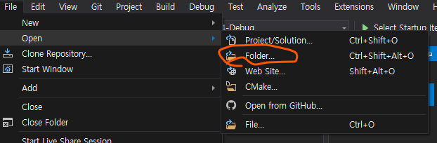
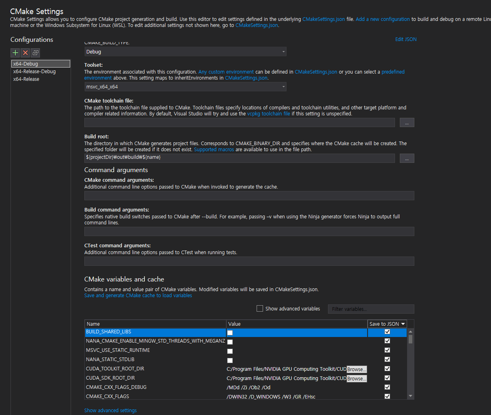

# AR Billiards

영상 인식을 통해 현실 세계의 당구를 인식하고, 증강 현실로 당구 플레이를 돕습니다. 

# 실행 시 dll 필요

- CUDA v10.0
- OpenCV v4.4.0

# 빌드 시 필요

- ZED SDK v3.2.1
- OpenCV 4.4.0
  - opencv_contrib 포함
- Boost 1.73.0
  - ASIO 및 관련 의존성 포함
- Unity 2019.3 LTS
- Oculus App

# 필요

- Oculus Rift (CV1 or S only)
- ZED Mini
- CUDA 10.2 이상 지원하는 GPU 장착 PC 

 
 

# 프로젝트 셋업 방법

> 사실 졸업작품 진행하면서 온갖 의존성을 덕지덕지 갖다붙이고, 뒷정리를 제대로 안한 탓에 저도 처음부터 빌드하라면 못 할 것 같습니다 ... 일단 필요한 사항은 아래에 적어 놓긴 했으니, 적당히 부딪쳐 보고 빠르게 손절 치시길 권합니다.

> git clone으로 프로젝트 루트를 복사한 후, '`git submodule update --init --recursive`' 명령어로 서브모듈 레포도 다운로드 해주세요.

> X86/x64 Windows 환경에서만 빌드 및 실행 가능합니다. (영상처리 프로그램에서 c++ AMP 기능이 윈도우에 의존)

`\Projects\CoreModel\` 폴더에 영상 처리 프로그램의 프로젝트가, `\Projects\UnityAr\` 폴더에 시각화 및 물리 시뮬레이션을 위한 유니티 프로젝트가 위치해 있습니다.

위의 [의존성](#빌드-시-필요) 라이브러리를 모두 설치하고, 전부 PATH에 등록하면 제일 간단하게 빌드 절차를 시작할 수 있습니다.

## 영상 처리 프로그램 빌드

Visual Studio 2019 이상에서 지원하는 CMake 확장 기능을 활용하길 권합니다. (제일 편한듯...)

위와 같이, 폴더 열기로 `\Projects\CoreModel\` 디렉터리를 열어주면 CMakeLists.txt를 알아서 인식합니다. 폴더의 `\Projects\CoreModel\CMakeSettings.json`이 Visual Studio가 CMake 프로젝트 구성을 위해 사용하는 여러 설정을 적어둔 파일인데, VS에서 열면 아래와 같은 화면이 보입니다.

몇 가지 컨픽을 해둔 상태인데, 좌측 리스트에서 Release-Debug configuration을 선택하고 `Boost_DIR, Boost_INCLUDE_DIR, OpenCV_DIR` 등등 Save To JSON 체크된 변수들 중 실행하려는 PC와 설정이 맞지 않는 항목을 현재 PC의 경로로 설정해주면 됩니다.

영상 처리 프로그램은 OpenCV 4.4.0 (opencv_contrib 기능을 일부 사용하므로, opencv를 소스에서 contrib을 포함해 빌드해야 합니다)과 Boost 1.73.0 이상 버전을 설치해야 하며, 나머지 의존성은 소스에서 빌드합니다.

## Unity Project 빌드

Unity Hub에서 `\Projects\UnityAr` 디렉터리를 Unity Project로 등록합니다.

상기한 바와 같이 2019.3 LTS 버전에서 작성되었습니다. 실행을 위해 CUDA 10.2, ZED SDK 3.2.1, Oculus App이 필요합니다. (전부 PATH에 등록해주면 됩니다)

모두 설치돼 있다면 특별한 세팅 없이 실행 가능할 것으로 보입니다. 유니티 프로젝트의 `Assets/Scenes/RecognitionMainScene`에 AR 당구 시각화에 관한 모든 기능을 넣어 두었습니다.

 
 

# INDEX

1. [프로젝트 세팅](/Docs/setup.md)
2. [영상 인식 알고리즘 작업 일지](/Docs/Old/Report/RecognitionImplLog/__content.md)